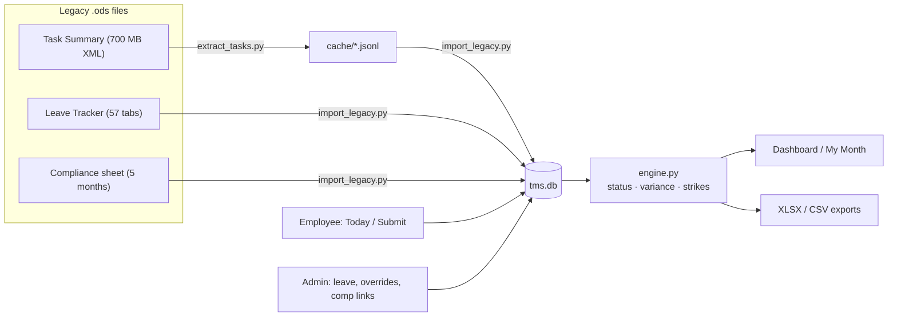

# MK Internal Timekeeping & Compliance App (POC)

**Status**

- ✅ Feature-complete against [PRD Draft v1](docs/PRD.md)
- ✅ Acceptance test passing (**168/168** historical strike counts reproduced)
- ✅ 233 unit tests green
- Updated 31 Jul 2026

One web app that replaces the three manual spreadsheets used to run offshore time tracking — the per-person **Task Summary** files, the 57-tab **Leave Tracker**, and the monthly **Compliance sheet**. The employee logs time once; leave, hours variance, and compliance status all derive from that single entry automatically. Interim tool until the third-party HR pilot concludes: **designed for export, not permanence.**

Beyond the original PRD build, the app now also has: real employee/admin login with self-signup passwords and lockout after repeated failures, break tracking with a live timer, a Punch In/Out countdown with automatic overtime tracking, an automatic Punch-Clock compensation balance, a three-tier admin role (Employee / department-scoped Admin / Super Admin), employee-submitted leave requests and support questions (with an admin approval/reply queue for each), profile photos, Personal Details and Employment Details self-service profile cards, bulk employee onboarding/updating/offboarding via an Excel upload, a redesigned live compliance dashboard, and two cascading-filter Reports pages (Attendance, Strikes) with XLSX export. See **[MK_Timekeeping_Documentation.pdf](MK_Timekeeping_Documentation.pdf)** for a plain-English, page-by-page walkthrough with a flow diagram — handy to hand to a non-technical stakeholder.

New to this codebase? Start with **[HANDOFF.md](HANDOFF.md)**. The original requirements are in **[docs/PRD.md](docs/PRD.md)**.

---

## Contents

1. [Quick start](#quick-start)
2. [Verify the build](#verify-the-build)
3. [App flow](#app-flow)
4. [Screens & roles](#screens--roles)
5. [How statuses, variance, and strikes are computed](#how-statuses-variance-and-strikes-are-computed)
6. [Data flow](#data-flow)
7. [Configuration reference](#configuration-reference)
8. [The legacy import (read before touching history)](#the-legacy-import)
9. [Project structure](#project-structure)
10. [Testing](#testing)
11. [Path to production](#path-to-production)
12. [Troubleshooting](#troubleshooting)
13. [PRD traceability](#prd-traceability)

---

## Quick start

> ⚠️ The project directory name ends with a **trailing space** (`.../Time Management System /`). Always quote paths.

```bash
cd "/Users/skennedy/Time Management System "
python3 -m venv .venv
.venv/bin/pip install -r requirements.txt

# one-time: stream-extract the 20 MB Task Summary file (~2 min, flat memory)
.venv/bin/python legacy/extract_tasks.py "Task Summary  - Divya (2).ods" legacy/cache/divya

# seed the database from all three legacy files
.venv/bin/python -m legacy.import_legacy

# run
.venv/bin/python -m uvicorn app.main:app --port 8127
```

Open **http://localhost:8127**. Sign-in behavior depends on `AUTH_MODE` (default `dev`):

- **`AUTH_MODE=dev`** (default, local only) — a pick-a-user screen, no password.
- **`AUTH_MODE=password`** — real Employee Login / Admin Login doors. First-time employees use **Sign up** to set their own password against the email an admin already put in the roster. Requires a real `SECRET_KEY` env var (the app refuses to boot without one outside `dev` mode). Repeated failed logins (5) lock that account out for 15 minutes.

A pre-seeded `tms.db` ships with the handoff bundle — with it you can skip the two import steps and run immediately.

### Demo mode (safe to show anyone)

`tms_demo.db` is committed to the repo: a full anonymized copy of the real data — every employee, client, and note replaced with fiction (see `demo/make_demo_db.py`, which refuses to build if its leak scan finds a single real string). Same five months of statuses, strikes, ledgers, and compensation links.

```bash
.venv/bin/python -m demo.run_demo        # demo app on http://localhost:8128
```

Rebuild after a fresh import with `.venv/bin/python -m demo.make_demo_db`. The real app (8127) and real DB are untouched.

## Verify the build

```bash
.venv/bin/python -m pytest tests/ -q       # engine, validation, util, bulk_upload, reports, auth, compensation, lists_bulk_upload  → 233 passed
.venv/bin/python -m legacy.verify_strikes  # PRD §12.3 acceptance       → 168/168 person-months match
```

`verify_strikes` recomputes every person's March–July 2026 monthly strike count from imported data and compares it to the legacy sheet's own `STRIKES FOR MONTH` values. **If you change the engine or importer, this must stay 168/168.**

## App flow

Every page in the system and which zone it belongs to — everyone signs in once, then lands in the Employee zone or the Admin zone depending on role:


(Same diagram as in [MK_Timekeeping_Documentation.pdf](MK_Timekeeping_Documentation.pdf), kept here so it stays visible directly in the repo.)

## Screens & roles

Everyone signs in through one login page (`/login`), then lands in one of two zones based on `Employee.is_admin`. An admin who is also an employee can switch into the Employee zone at any time via the "Employee login" nav link, and back again via "Admin Dashboard" — both zones' nav items are always reachable, never gated on `tracked`.

**Three admin tiers** (`Employee.is_admin` + `Employee.is_super_admin`, set via Roster → Add/Edit person's Role dropdown, or the bulk-upload Role column):

| Role | `is_admin` | `is_super_admin` | Sees |
|---|---|---|---|
| Employee | ✗ | ✗ | Employee zone only |
| Admin (department-scoped / team lead) | ✓ | ✗ | Dashboard, Leave Requests, Reports, Suggestions, and Assignments — all filtered to their own `Employee.department` |
| Super Admin | ✓ | ✓ | Every admin screen, every department — the pre-existing full admin experience |

A department-scoped admin can approve/reject leave, review project/task suggestions, manage assignments, and view attendance/strike detail only for people in their own department (enforced server-side on every route, not just hidden in the UI); Roster, Projects & Tasks, Settings, Audit Logs, Support Inbox, and both bulk-upload screens stay Super-Admin-only. Existing admins are automatically promoted to Super Admin the first time the app starts after this upgrade (`app/util.py ensure_super_admin_backfill`), so nobody who could already see everything loses access.

**Employee zone**

| Screen | URL | What it does |
|---|---|---|
| Today | `/today` | Log task rows (searchable project/task combo, details, start/end). Duration and daily total are computed, never typed. Overlaps blocked; >15 min gaps flagged (not blocked); 4 h row cap; back-dating limited to N working days. Start/end a Personal or Lunch/Dinner break with a live timer — time beyond the configured allowance automatically extends that day's target. **Punch In/Out** shows a live personal countdown to today's target (reuses the same break-allowance rule); once the target's reached, a banner marks the switch to overtime and the same number counts up from zero. Display only, it doesn't log work; task rows below are still what compliance is computed from — but completed overtime does roll up into Reports → Attendance. **Auto time capture** (Start/Stop Timer widget) auto-fills a task row's Start/End from the system clock instead of typing times by hand — single active timer per employee; starting a new one auto-stops and logs whatever was already running. Runs through the exact same validation as a typed row (overlaps, 4 h cap, details length). A "Suggest a new project/task" panel lets an employee add one that's usable on their own entries immediately, staying hidden from everyone else until a team lead approves it (Admin → Suggestions). **Submit Day** locks the day. |
| My Month | `/my-month` | Own status calendar, hours vs target per day, running variance balance, leave by category, live strike count (deliberate: today people find out after the fact). Also shows a **compensation balance** — automatic, derived from Punch In/Out: a day punched short of target adds to what's owed, a day punched over target pays it back down, and overtime beyond what's owed banks as a credit (signed — e.g. short 1h Monday + over 3h Tuesday shows **+2:00**, not 0:00). Resets every calendar month; doesn't carry into the next one. Separate from the variance balance above (which comes from logged task rows, not the punch clock) and from the manual Compensation links admins create. |
| Leave | `/leave` | Request time off (full day or partial hours, with type + note); withdraw a still-pending request; see every past request's status and any admin review note. |
| Support | `/support` | Ask an admin a question and see their reply once resolved. |
| Profile | `/profile` | Upload/replace a profile photo (JPEG/PNG/WebP, ≤2 MB). Two more cards: **Personal Details** (`/profile/personal-details` — DOB, blood type, gender, marital status, family, nationality, hobbies/skills/languages, plus every contact number and address in the same form) and **Employment Details** (`/profile/employment-details` — bank account + PAN/Aadhaar/UAN/ESI; sensitive numbers are masked to last-4 everywhere, including to admins, the instant they're saved). Both are self-service and optional. |

**Admin zone**

| Screen | URL | What it does |
|---|---|---|
| Compliance dashboard | `/admin` | The monthly sheet rebuilt live: live today's-attendance KPI cards (logged/on leave/not yet logged), department drill-down cards, a monthly grid (rows = employees, columns = days, cells = auto-derived status), strikes per row, violation flag at threshold, a "needs attention" panel (pending leave/violations) and recent audit activity. Filters: month, department, exceptions-only. Nothing here is typed. **Department-scoped admins** only ever see their own department's card, grid, and needs-attention items — the "All departments" card, Support previews, and audit-activity feed are Super-Admin-only. |
| Person detail | `/admin/person/{id}` | Full log, ledger with running balance, leave history, breaks, day-status overrides (mandatory reason, audited, ⚑-flagged; Super-Admin-only), submission unlocks (Super-Admin-only), manual compensation links (Super-Admin-only), automatic Punch Clock compensation breakdown (read-only, any admin who can view this person), XLSX export. Read-only Personal Details and Bank & Statutory Details cards (sensitive numbers masked, same as the employee's own view) once the employee has filled them in via Profile. A department-scoped admin can only open this page for someone in their own department. |
| Roster | `/admin/roster` | **Super-Admin-only.** Add/edit/deactivate people; department, designation, per-person daily target, per-person work-day schedule, start date, phone, DOB, Role (Employee / Admin / Super Admin), **Reports to** (who this person's team lead/manager is — display/reference only, nothing in the engine reads it), tracked flag. Each person gets an auto-generated `employee_code` (`LOMK001`, `LOMK002`, …). Deactivation keeps history, drops the person from compliance runs. Table has a live name search box. |
| Roster → Bulk upload | `/admin/roster/bulk-upload` | **Super-Admin-only.** One Excel upload handles three things at once, told apart per row by whether **Employee ID** is filled: blank → onboard a new hire (Full Name/Department/Designation/Target-day/Workdays required); filled → update only the columns provided (blank cells are left untouched, not cleared); filled **+ Action=Deactivate** → bulk-offboard that person (soft deactivate, history kept, never a hard delete). Role column accepts Employee/Admin/Super Admin; **Reports To** column takes another row's Employee ID (must already exist — can't point at another new hire in the same sheet). Download a blank template or an export of all current employees to edit and re-upload. See `app/bulk_upload.py`. |
| Suggestions | `/admin/suggestions` | Approve/reject Project/Task suggestions employees or leads have submitted from Today. **Department-scoped admins** see only suggestions from their own team (scoped by the *submitter's* department); Super Admins see everything. Approving makes it visible to everyone; rejecting also deactivates it so it stops being usable even by whoever suggested it. |
| Assignments | `/admin/assignments` | Pick an employee, tick which projects/tasks they're assigned to. **Advisory only** — assigned items show first and starred on that employee's Today entry form, but nothing is enforced; anyone can still log time against any active project/task, so a rollout with incomplete assignments never blocks someone from logging their day. Department-scoped admins can only assign within their own team. |
| Reports → Attendance / Strikes | `/admin/reports/attendance`, `/admin/reports/strikes` | Two report pages sharing one cascading filter bar: Department → Employee → Date range (Last 7 days / Last month / Last 3 months / custom). Pick "All Employees" for a summary table (attendance % or strike count per person); pick one person for their day-by-day detail instead. Both export to XLSX. Attendance Reports also show **Overtime** — completed Punch In/Out time beyond each day's target, derived the same "computed, never typed" way as everything else; doesn't affect strikes. **Department-scoped admins** have the Department filter locked to their own department (the "All Departments" option is hidden). See `app/reports.py`. |
| Lists | `/admin/lists` | **Super-Admin-only.** Manage Project/Employer and Task dropdowns. Deactivating hides a value from new entries without breaking old rows. Convention for unexpected downtime (power cuts, system outages): add a Project called "Not Related to Project" and a Task Type called "Power Cut / System Issue" so employees have something to log the gap against once the system's back — no separate feature, just two entries here. |
| Lists → Bulk upload | `/admin/lists/bulk-upload` | **Super-Admin-only.** Two independent single-column sheets — one for Projects/Employers, one for Tasks — for adding many dropdown values at once. Add-only: a name already on the list is skipped, not duplicated; renaming/deactivating still happens on the Lists page itself, not via this sheet. Each side has its own blank template and a download of the current list. See `app/lists_bulk_upload.py`. |
| Leave requests | `/admin/leave` | Approve/reject pending employee leave requests (with a note), or record already-approved leave directly on someone's behalf. Recomputes affected days immediately. Below that: Approved leaves, Pending leaves (read-only mirror of the pending queue above, searchable), and a leave-balances table (annual Casual/Sick/Vacation entitlement per employee, display only — see §10.6). **Department-scoped admins** see and can act on only their own department's requests/records; "Bulk assign leaves" is Super-Admin-only. |
| Bulk assign leaves | `/admin/leave/bulk-upload` | **Super-Admin-only.** Set (or bulk-correct) each employee's annual Casual/Sick/Vacation entitlement via a small Employee-ID-keyed Excel sheet — same overwrite-on-reupload pattern as the roster bulk upload, but never creates employees. |
| Config | `/admin/config` | **Super-Admin-only.** Every PRD §10 open question as a dial (including the daily break allowance), plus the company holiday table. |
| Audit | `/admin/audit` | **Super-Admin-only.** Last 300 audited actions (unlocks, overrides, config changes, imports, comp links, bulk uploads…). Read-only — nothing here can be edited or deleted from the UI. |
| Support inbox | `/admin/support` | **Super-Admin-only.** See and reply to open employee support questions; mark resolved. |
| Exports | `/export/…` | `dashboard.xlsx` and `person/{id}.xlsx` follow the same department scoping as Dashboard/Person detail. `entries.csv?start=&end=` (org-wide raw dump, not linked from any screen) is **Super-Admin-only**. |
| Health check | `/healthz` | Runs a real `SELECT 1` — an uptime monitor target for whatever host runs this (checks DB connectivity, not just process-alive). |

A full plain-English walkthrough of every page and feature, with a flow diagram, is in **[MK_Timekeeping_Documentation.pdf](MK_Timekeeping_Documentation.pdf)**.

## How statuses, variance, and strikes are computed

All in [app/engine.py](app/engine.py). Computed on page load and on every relevant change (submission, leave, override, comp link) — no typing, no nightly batch needed at this scale (a Recompute button exists anyway).

| Status | Condition |
|---|---|
| **Complete** | Day submitted and `actual ≥ target − tolerance` |
| **Partial** | Day submitted and `actual < target − tolerance` |
| **Missing** | *Past* working day, no submission, no covering leave. Today is never Missing — it isn't over. |
| **Leave** | Approved leave covers the (possibly reduced) full target |
| **Holiday / Weekend** | Non-working day per person schedule or holiday table. Hours logged anyway count as pure surplus (weekend make-up work is real and feeds compensation). |

- `variance = actual − effective_target`, where approved leave reduces the target (full-day leave ⇒ target 0, variance 0). The ledger shows per-day variance and the **running net balance** the old tracker implied but never computed.
- `strikes(month) = count(Missing) + count(Partial)` — the sheet's own verified rule.
- **Precedence:** admin override (mandatory reason, audited) → compensation (a fully-covered shortfall reads Complete; original status retained) → base computed/imported status. Legacy pre-policy days carry `strike_exempt` and can never strike.
- **Violation** = strikes ≥ threshold ⇒ dashboard flag only. Pay action stays human (PRD §6).
- Compensation links: one shortfall day → one or more surplus days; a surplus day can back only one shortfall; "fully compensated" means linked surplus ≥ deficit.

## Data flow



Two kinds of `DayStatus` rows coexist:

- `source='imported'` — **frozen legacy fact**, raw sheet token retained, never recomputed.
- `source='computed'` — rebuilt from live entries/leave at any time, from `live_start_date` onward.

## Configuration reference

Admin → Config. Stored in the `config` table; defaults in [app/models.py](app/models.py) (`CONFIG_DEFAULTS`).

| Key | Default | Meaning | PRD |
|---|---|---|---|
| `tolerance_minutes` | 60 | Below `target − tolerance` ⇒ Partial | §10.2 |
| `strike_threshold` | 5 | Monthly strikes ⇒ In-Violation flag | §10.1 |
| `max_row_minutes` | 240 | Max single entry length | §4 |
| `backdate_working_days` | 1 | How far back employees may log | §10.7 |
| `gap_flag_minutes` | 15 | Gap size that gets a visual flag | §4 |
| `min_details_chars` | 5 | Details minimum length | §4 |
| `comp_erases_strike` | on | Fully compensated shortfall reads Complete | §10.3 |
| `live_start_date` | import day | Frozen history before, live computation after | §9 |
| `max_break_minutes` | 30 | Daily break allowance; time over this extends that day's target | — |

Per-person schedule (work days, daily target) lives on the roster (§10.8). Holidays are an admin-maintained table, single region (§10.9). Leave quotas: not enforced, totals displayed (§10.6).

## The legacy import

`legacy/` contains a stdlib-only **streaming ODS reader** (`ods_reader.py`) built to survive the degraded files (flat memory over the 700 MB XML; caps the 16,331 repeated empty columns per row), the task **extractor** (`extract_tasks.py`, reusable for any Task Summary file), the **importer** (`import_legacy.py`), and the **acceptance verifier** (`verify_strikes.py`).

Truths the importer encodes — discovered from the files, not assumed:

1. **Only literal `N`/`PARTIAL` are strikes** (the sheet's COUNTIF). Free-text hours ("4 hours 30 min", "LOGIN-… Hours-8.10 hrs …"), `TRAVEL`, `Absent`, `LE`, `working` never counted — they import as non-strike statuses with the raw token kept.
2. **April 2026 formulas count only from Apr 15** (compliance policy start — the ranges literally start at column R). Pre-policy N/PARTIAL days keep their true status but are `strike_exempt` (faded on the dashboard). Without this, 13 person-months don't reproduce.
3. **Weekend free-text hours are surplus**, imported as Weekend status with positive variance — that's the make-up time compensation links point at.
4. **Names drift across months.** Variant merging is deliberately conservative (space-stripped equality / ≥6-char prefix / shared ≥6-char surname, and only when the two records never overlap in time): `Haswatha`≡`Haswathi`, `Maha Lakshmi`≡`Mahalakshmi`, `Sreenivasan`≡`Srinivasan Jayamoorthy`, tracker tab `Surendhar` → `Surendar Lakshmanan` — while `Krithika` ≠ `Karthika` stay distinct. Junk rows (`Mail Room / Print`) dropped.
5. **Leave tracker** rows become leave/incident records (notes preserved); the monthly `extra`/`short` blocks become per-day variance so running balances carry history; `Standard work hours: Total X` rows set per-person targets; post-`GONE` tabs import as deactivated people with history.
6. **The hidden `List` sheet** seeds the real dropdowns: 297 Project/Employer values, 35 task types.
7. **Task history is best-effort** (PRD §11): 677 real rows recovered from ~1.05 M junk rows; the 12-hour-clock wrap bug (12:00→1:00 logged as a 13-hour task) is normalized monotonically; 492 rows had full times and became entries + locked submissions; 185 without times are listed in the report.
8. Company holidays are auto-detected when ≥5 people share a `Holiday` token on the same date.

Every anomaly the importer tolerates is written to **`legacy/cache/import_report.json`** — duplicates merged, tokens skipped, unmatched tabs, unanchored variance, skipped task rows. Read it after any re-import.

**Re-import from scratch** (the importer refuses to run into a non-empty DB):

```bash
rm tms.db && .venv/bin/python -m legacy.import_legacy && .venv/bin/python -m legacy.verify_strikes
```

## Project structure

```
app/
├── routes/
├── templates/
│   └── admin/
├── static/
├── main.py
├── db.py
├── models.py
├── engine.py
├── validation.py
├── auth.py
├── security.py
├── rate_limit.py
├── bulk_upload.py
├── reports.py
├── util.py
└── templating.py
legacy/
demo/
tests/
docs/
HANDOFF.md
MK_Timekeeping_Documentation.pdf
```

**Key files**

| Path | What's there |
|---|---|
| `app/main.py` | FastAPI app, session middleware, exception → error-page handlers, `/healthz`, startup hooks |
| `app/db.py` | Engine/session setup; SQLite by default, `DATABASE_URL` for Postgres |
| `app/models.py` | All entities (PRD §8) + `CONFIG_DEFAULTS` — minutes everywhere |
| `app/engine.py` | Status/variance/strike computation, recompute, ledger, `today_attendance()` |
| `app/validation.py` | PRD §4 entry rules, back-dating window, gap flags |
| `app/compensation.py` | Automatic Punch Clock compensation balance (`monthly_summary()`) — independent of `engine.py`/`DayStatus`/strikes, see its module docstring |
| `app/auth.py` | `AUTH_MODE` (`dev` / `password` / `entra`) — the Entra ID swap point. Also `require_super_admin` and `admin_department_scope()` — the department-scoping gate used by Dashboard/Leave Requests/Reports |
| `app/security.py` | Stdlib password hashing (`AUTH_MODE=password`) |
| `app/rate_limit.py` | In-memory login/signup lockout after repeated failures |
| `app/bulk_upload.py` | Roster Excel parsing: onboard / update / bulk-deactivate |
| `app/leave_bulk_upload.py` | Leave-allocation Excel parsing: bulk-set Casual/Sick/Vacation entitlement by Employee ID |
| `app/lists_bulk_upload.py` | Single-column, add-only Excel parsing for Project/Employer and Task Type dropdown values |
| `app/reports.py` | Attendance/Strike report aggregation, cascading filters |
| `app/util.py` | Formatting filters, `FormError`, `audit()`, employee-code generation, `xlsx_response()` |
| `app/templating.py` | Jinja env, filters (`hm`, `hm_signed`, `clock`, `tojson`), flash helpers, nav badges |
| `app/routes/` | `auth` (login/signup), `employee` (Today/My Month/Leave/Support/Profile), `admin` (dashboard/roster/lists/leave/config/audit/support), `reports`, `exports` |
| `app/templates/` | Base layout + employee pages + `admin/` pages (server-rendered, small inline JS) |
| `app/static/` | `app.css`, `tablefilter.js` (table search), `combo.js` (searchable select) |
| `legacy/` | Streaming ODS reader, task extractor, importer, acceptance verifier — see [The legacy import](#the-legacy-import) |
| `demo/` | `make_demo_db.py` (builds anonymized `tms_demo.db` + seeds fixed test logins), `run_demo.py` (runs on port 8128), `seed_test_logins.py` |
| `tests/` | 233 tests: engine, validation, util, bulk_upload, leave_bulk_upload, lists_bulk_upload, reports, auth, compensation |
| `docs/PRD.md` | The requirements this was built against |
| `HANDOFF.md` | Read this first if you're picking the project up |
| `MK_Timekeeping_Documentation.pdf` | Plain-English page/feature guide + flow diagram, for non-technical stakeholders |

No JS framework, no build step; the only runtime deps are FastAPI, SQLAlchemy, Jinja2, openpyxl (see `requirements.txt` for the full list, including `psycopg[binary]` for Postgres).

## Testing

```bash
.venv/bin/python -m pytest tests/ -q
```

- `test_engine.py` — status mapping incl. exact tolerance boundaries, leave-reduced targets, weekend surplus, part-time targets, strike counting, compensation on/off, override precedence, pre-policy exemption.
- `test_validation.py` — overlaps, touching rows, midnight/duration/details rules, locked days, deactivated dropdown values, back-dating across weekends and holidays, gap flags, and (Ganesh, 2026-08-01) pending Project/Task suggestions usable only by whoever submitted them, rejected suggestions unusable even by the submitter.
- `test_util.py` — formatting/parsing helpers, including `role_to_flags`/`flags_to_role` (the three-tier admin role mapping) and `ensure_bootstrap_admins` (creates the initial Super Admins on a fresh deploy only, permanent no-op once any employee exists).
- `test_bulk_upload.py` — header matching, required-vs-optional fields by mode (new hire vs update), partial-update semantics, bulk-deactivate via the Action column, sample/export workbook round-trips, and the **Reports To** column (resolves against an already-existing Employee ID, works on both new-hire and update rows, unknown code is a clear error).
- `test_leave_bulk_upload.py` — Employee-ID resolution, blank-vs-provided leave-count semantics (blank = unchanged, 0 = provided), whole-number validation, sample/export workbook round-trips.
- `test_lists_bulk_upload.py` — single-column header matching (case-insensitive), blank-row skipping, add-only dedupe (already-on-the-list vs. duplicate-within-file), project vs. task kind routing to the right model, sample/existing workbook contents.
- `test_reports.py` — date-range resolution (presets, custom, fallback), department/employee scoping, summary vs. daily-drill-down output, strike-exempt exclusion.
- `test_auth.py` — `admin_department_scope()`: super admin unrestricted, department-scoped admin locked to their own department (including the blank-department "—" fallback).
- `test_compensation.py` — automatic Punch Clock compensation balance: shortfall accumulation, overtime paying it down, overtime beyond what's owed banking as a signed credit (no floor either direction), leave/holiday/weekend days excluded, still-open punch sessions not counted, month isolation, day-breakdown sorting.

Schema changes: there's deliberately no migration tool in the POC — `rm tms.db`, re-run the importer (~40 s total). New nullable columns are picked up automatically at next startup via `app/db.py`'s additive-migration guard; anything more involved than adding a nullable column still means `rm tms.db` + re-import.

## Path to production

The PRD's §9 targets, updated for the actual rollout plan (self-signup auth + Azure App Service hosting):

1. **Postgres** — set `DATABASE_URL=postgresql+psycopg://…` (`psycopg[binary]` is already in `requirements.txt`). No code changes; SQLAlchemy handles the dialect. Do this before multi-user rollout (~45 people submitting at end of day). **Azure Database for PostgreSQL – Flexible Server** is the managed option: create it in the same resource group as the App Service, then set `DATABASE_URL` to `postgresql+psycopg://<user>:<password>@<server-name>.postgres.database.azure.com:5432/<db-name>?sslmode=require` (Azure Postgres requires TLS — `sslmode=require` is not optional).
2. **Real auth — done for password mode.** `AUTH_MODE=password` gives every employee their own email/password (self-signup against a roster row an admin already created), with rate-limited lockout after repeated failures. A real `SECRET_KEY` env var is required outside `dev` mode — the app refuses to boot without one. `AUTH_MODE=entra` (MSAL OAuth mapping the tenant email → `Employee.email`) remains the longer-term target in [app/routes/auth.py](app/routes/auth.py) if/when the org standardizes on Entra ID — since hosting is already on Azure, that's a same-tenant swap later, nothing else in the app changes when it happens.
3. **Hosting (Azure App Service, Linux, Python)** —
   - Create the Web App (Linux, Python 3.9 runtime — matches this project's hard rule against `X | Y` union syntax) in the Azure Portal or via `az webapp up`.
   - Set the **Startup Command** (Portal: Configuration → General settings → Startup Command, or `az webapp config set --resource-group <rg> --name <app> --startup-file "gunicorn -w 2 -k uvicorn.workers.UvicornWorker -b 0.0.0.0:8000 app.main:app"`) — `gunicorn` is already in `requirements.txt` for this. Python 3.9 needs an explicit startup command; App Service only auto-detects FastAPI without one on Python 3.14+.
   - App Settings (Configuration → Application settings): `SECRET_KEY` (long random value), `AUTH_MODE=password`, `DATABASE_URL` (above), `AVATAR_UPLOAD_DIR=/home/data/avatars`, `BOOTSTRAP_ADMINS` (see below).
   - **First-login bootstrap**: a brand-new Postgres database has zero employee rows, and `/signup` only lets someone *claim* an existing roster row — it never creates one — so without this, nobody could ever sign in. `BOOTSTRAP_ADMINS` (format `Name:email,Name:email,...`) creates the listed people as Super Admins on first startup only; it's a permanent no-op the instant any employee row exists, so it's safe to leave set forever (see `app/util.py` `ensure_bootstrap_admins`). Once the real leaders have signed up and onboarded everyone else via bulk upload, this setting can be left as-is or removed — either way it does nothing further.
   - **Profile photos**: `/home` is the one part of an App Service Linux instance that persists across restarts *and* redeploys (everything else, including the deployed code tree itself, gets replaced on every deploy) — see `app/routes/employee.py`'s `AVATAR_DIR`/`AVATAR_UPLOAD_DIR`. Setting `AVATAR_UPLOAD_DIR=/home/data/avatars` (any path under `/home`) is enough; the app creates the directory itself at startup and serves it at the same `/static/uploads/avatars/…` URL as before via a dedicated mount in `app/main.py` — no template changes, no separate volume/storage account to provision. Leaving the env var unset falls back to the original in-repo path (fine for local dev, not for App Service).
   - `/healthz` is already wired up — point App Service's Health check (Portal → Monitoring → Health check) at it.
   - Custom domain: add it under Custom domains, then add the CNAME/TXT records at the DNS provider; bind a free App Service Managed Certificate once the domain's verified (usually well under an hour).
   - Run the importer once against the final copies of the three legacy files, then freeze the spreadsheets read-only.
4. **Cutover checklist** — verify 168/168 on the production import; fix the two roster items flagged in the import report (part-timer targets); replace any remaining test employee data with the real team; assign roles (Super Admin for whoever needs org-wide visibility, department-scoped Admin for team leads — Roster → Edit → Role, or the bulk-upload Role column); announce; spreadsheets become read-only archives.

<sub>The repo's [Procfile](Procfile) is left in place from an earlier Railway-hosting plan — harmless (Azure App Service doesn't read it), and still useful if a Procfile-respecting host is ever used instead. The Startup Command above is what Azure actually uses.</sub>

## Troubleshooting

| Symptom | Cause / fix |
|---|---|
| `No such file or directory` on cd | The directory name ends with a space — quote it: `cd "/Users/skennedy/Time Management System "` |
| Importer prints "Database is not empty — refusing" | By design. `rm tms.db` first (or keep the DB — it means you already imported). |
| Port 8127 in use | Another instance is running: `lsof -ti:8127 | xargs kill` |
| Dashboard shows `·` on a past weekday | Legacy blank (no sheet mark) — historical blanks are *not* fabricated into Missing. Live days after `live_start_date` do compute Missing. |
| A person's April strikes look "too low" | Pre-policy days (before Apr 15 2026) are strike-exempt, matching the sheet's own formulas. Hover the faded cells. |
| Times look shifted 12 h in old task rows | The legacy files logged 12-hour clock times without AM/PM; the importer normalizes monotonically per day. Raw values are in `legacy/cache/divya.jsonl`. |

## PRD traceability

| PRD | Where implemented |
|---|---|
| §4 entry rules + submission/locking | `app/validation.py`, `app/routes/employee.py`, Today screen |
| §5 leave, variance, running balance, compensation | `app/engine.py`, `app/routes/admin.py` (leave, comp links), My Month + Person screens |
| §6 statuses, strikes, overrides, violations | `app/engine.py`, DayStatus model, dashboard + person screens |
| §7 all screens (grown well beyond the original nine) | `app/routes/` + `app/templates/` (see [Screens & roles](#screens--roles)) |
| §8 data model | `app/models.py` (minutes-based; `unlock_log` realized as audit entries + `unlock_count`) |
| §9 seed import + acceptance | `legacy/import_legacy.py`, `legacy/verify_strikes.py` → **168/168** |
| §10 open questions | all nine are config dials / roster fields (see [Configuration reference](#configuration-reference)) |
| §11 out of scope | honored; see HANDOFF for the fast-follow list |
| §12 success criteria | 1: zero-arithmetic flow verified · 2: dashboard live · 3: 168/168 · 4: three export endpoints |
