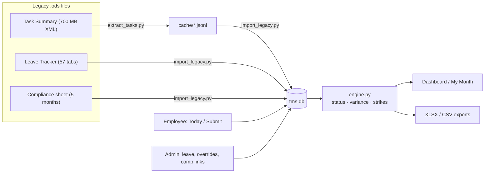

# MK Internal Timekeeping & Compliance App (POC)

**Status**

- ✅ Feature-complete against [PRD Draft v1](docs/PRD.md)
- ✅ Acceptance test passing (**168/168** historical strike counts reproduced)
- ✅ 382 unit tests green as of 10 Aug 2026 — this batch (21 Aug 2026) adds more (see Testing below); run `pytest` for the current exact count
- ⚠️ Leave Management V2 (see feature-flag note below) is **enabled by default** as of 22 Aug 2026. `pytest` ran clean (minus one unrelated, since-fixed test flake); `legacy.verify_strikes` could not run at all (legacy data bundle still missing, see below) and has NOT confirmed 168/168 against this change — Ganesh made an informed call to enable anyway rather than wait on that bundle
- ✅ Task Planning ("Plan for the Day" + Start/Pause/Resume/Stop, see note below) is live, no flag — touches neither `engine.py` nor `validation.py`, so it's outside the pytest/verify_strikes hard rule, though a real `pytest` run (particularly `tests/test_task_planning.py`) is still worth doing before deploy
- ✅ Developer Usage Report (adoption of Plan/Auto time capture/Add Row/Punch In-Out, see note below) is live — new `TaskEntry.entry_method` tracking only applies to rows logged from 21 Aug 2026 onward, so any range before that reads 0% (expected, not a bug)
- ✅ Time by Project/Task report gained a **By Project** breakdown with a hand-drawn pie chart (see the Reports row below) — 24 Aug 2026
- ✅ Reports (Attendance, Strikes, Time by Project/Task) redesigned with KPI tiles and day-strip mini calendars; new **Task Logs** report with a daily summary and an "unplanned task" flag, plus by-employee/by-project Excel downloads (see the note below — the daily summary is rule-based, not an LLM call) — 29 Aug 2026
- ✅ Projects & Tasks page redesigned as a Department → Project → Task tree, with inline task-level rename/deactivate; "Assignments" renamed to **Assign Work** (with a Department → Employee picker tree) and gained the ability to assign a task straight into an employee's Plan for the Day (previously Person Detail-only — still there too, just also reachable from here) — 29 Aug 2026
- ✅ Time by Project/Task's Employees/Projects/Tasks filters became closed-until-clicked dropdowns (same style as the Department field beside them); **By Project** switched from a table to a nested horizontal bar chart (project bar + indented task bars underneath, scaled against the busiest project so bars stay comparable at a glance) — 30 Aug 2026
- ✅ Dashboard gained a **Compliance Trend** card — a weekly line chart (last 8 Monday-Sunday weeks) of % of employees under the strike threshold, a dashed target line (new `compliance_target_pct` config, default 90%), and a real root-cause note naming which department accounts for the most recent drop, when there is one — 30 Aug 2026
- ✅ Task Logs' daily summary is an LLM call, shown only on the admin report, falling back to the unchanged rule-based bullets whenever the LLM backend isn't reachable or a call fails. Originally Anthropic, then Gemini, then briefly a self-hosted Ollama server (all removed/replaced in turn — see git history), **now Groq's hosted API** (`GROQ_API_KEY`/`GROQ_MODEL`, see "AI day summaries" below) as of 2 Sep 2026 — genuinely free tier, and Groq states it does not train on customer data on any tier (unlike Gemini's free tier)
- ✅ Multilevel approval for Leave, Overtime, and Overtime ↔ Missed Hours match requests — an employee's request now optionally goes through a department-scoped "Team Lead" accept/deny-with-reason recommendation stage before the existing Super Admin makes the actual final approve/reject call, behind `MULTILEVEL_APPROVAL_ENABLED` (default on); requests already pending when this shipped were grandfathered to the old single-step flow — 1 Sep 2026
- ✅ A visual step-progression tracker (a "Progress" column: Submitted → Team Lead Review → Approved/Rejected) shows on both the employee's own "Your requests" tables and the admin Pending tables, for all three multilevel-approval request types — 2 Sep 2026
- ✅ Department-scoped admins gained **view-only** access to Leave Management/Overtime Management (previously Super-Admin-only end to end since 28 Aug 2026) — every Approve/Reject/Add/Grant/Delete action stays Super-Admin-only, enforced server-side, not just hidden in the UI
- ✅ Card headers on every admin and employee page now get their own separated title box, generalizing the 2026-08-29 Today-page-only treatment app-wide
- ✅ The standalone "Profile" nav link is gone — click your name/photo in the top-right chip instead, on every tier
- ✅ Admin Dashboard: **Compliance Trend** moved (and its label-overlap bug fixed) into Recent activity's old slot; Recent activity itself removed; a new **Projects Progression** bar card (percentage-of-busiest-project only, no raw hours) took Compliance Trend's old slot
- ✅ Roster: "Add person" moved above the employee table; the table is now grouped by department instead of one flat list
- ✅ Projects & Tasks tree: the "+ Task"/"Edit"/"Deactivate" row actions are always visible now, not just on hover
- 🐛 **Bug fix (2 Sep 2026):** a department-scoped Admin was being silently re-promoted to Super Admin on every app restart — `ensure_super_admin_backfill()`'s startup query (`app/util.py`) matched `is_super_admin.isnot(True)`, which in SQL also matches an explicit `False`, not just a genuinely un-migrated `NULL`. Fixed to `is_super_admin.is_(None)`. **Does not retroactively fix anyone already wrongly promoted** — check Roster for any Admin who should be department-scoped but currently shows Super Admin, and reset their Role via Roster → Edit.
- ✅ Departments are now a real managed list, not free text — a new "Departments" section on Roster → Bulk upload (Add/Rename/Deactivate), and the Add-person/Edit-person Department field is now a dropdown fed from it instead of a free-text box. Existing employees' current department values were auto-imported as the starting list. The bulk-upload Excel's own Department column is unchanged (still free text, not validated against this list) — 3 Sep 2026
- ✅ My Hours (employee-facing) gained a simple **"Where your hours went this month"** bar chart — one bar per project, total time logged this month, capped to the top 8 with an "Other" bucket for the rest. Deliberately a flat per-project total, not a day-by-day breakdown, per Ganesh's own "simple ... employees can able to understand" ask — 3 Sep 2026
- 🐛 **Bug fix (3 Sep 2026):** an employee's already-running Auto time capture timer became permanently stuck (couldn't Stop, Pause, or start anything else) if an admin narrowed that project's department scoping — or unlinked its task — while the timer was still open. `validate_entry()` gained a `closing_existing` flag that lets an already-started timer close out under whatever rule was in effect when it began, without loosening any other check. See `app/validation.py`/`app/routes/employee.py`'s `_log_timer_as_entry()`.
- ✅ Projects & Tasks tree now shows a **"pending approval"** badge on any project/task that's still an unreviewed employee suggestion — prompted by a department admin finding unfamiliar projects/tasks under her department with no way to tell, without separately checking Suggestions, that they simply hadn't been approved or rejected yet. Template-only fix (`admin/lists.html`), reuses the same `.badge b-pending` style already used for "pending approval" on Overtime Management's compensation links — 3 Sep 2026
- ✅ **Employment Details / "Bank & statutory details" hidden by default**, with a new Super-Admin toggle on `/admin/config` to turn it back on at runtime (no redeploy) — unlike this app's other on/off feature flags (env-var based), this one is a real `Config`-table value so a Super Admin can flip it themselves. Hidden from both surfaces: the employee's own Profile card and admin Person Detail's read-only view. The "complete your profile" nag popup was also fixed in the same pass so it stops requiring bank details while the section is hidden — 3 Sep 2026
- ✅ Projects & Tasks: the "All departments" **Category → Task hours breakdown removed** (it was effectively showing almost every task in the system, since only a few are ever linked to a specific project — not a data leak, just confusing) — "All departments" now reads as a plain project list like every other department group. A lightweight **"Tasks not linked to any project"** list replaces it so an unlinked task stays findable/renameable/deactivatable. This also fixes the tree search not finding a task that only lived in that old grouping (e.g. "Send client emails") — the new list is a plain always-visible list, not a collapsible/filterable tree node, so it can't be hidden by search anymore — 3 Sep 2026
- ✅ The "Tasks not linked to any project" list gained a **"Manage projects"** action so an unrestricted task can be linked to one or more projects right from there — the backend route for this already existed but had lost its only UI entry point when the old "All Tasks" table was removed — 3 Sep 2026
- 🐛 **Bug fix (3 Sep 2026):** typing an existing unlinked task's exact name into a project's own "+ Task" quick-add used to just reject it ("already exists") and leave it unlinked — the natural way someone would try to "move" a task out of the "Tasks not linked to any project" list. It now links the existing task to that project instead (additive — any other project(s) it's already linked to are untouched) unless it's already linked there, in which case it says so clearly. See `lists_add()` in `app/routes/admin.py`.
- ✅ Projects & Tasks: **deactivated projects/tasks moved out of the tree into their own "Deactivated Projects"/"Deactivated Tasks" lists**, instead of staying inline grayed-out — each row has Reactivate plus (for a project) a "Manage departments" panel and (for a task) the same "Manage projects" panel the unlinked-tasks list already has, both pre-checked from whatever it was already linked to before being deactivated. No new routes — this reuses the existing rename/toggle/departments/projects routes, just relocates the UI. Also fixes a real orphaning edge case: a still-active task whose only link pointed at a project you just deactivated now correctly falls back into "Tasks not linked to any project" instead of disappearing from view entirely — 3 Sep 2026
- ✅ The **automatic monthly compensation balance switched from Punch In/Out to logged Task Log time** ("Compensation owed this month" on My Month, and Person Detail's matching KPI/table) — Task Log time is now the one authoritative "actual hours" source everywhere in the app, so this was the last place still reading Punch In/Out. One real, documented difference remains: hours logged on an off day (weekend/holiday) to compensate count in the Running hours balance figure above it but not in this one, since this feature has always only counted days with a positive target — 3 Sep 2026
- ✅ Today page: the **Mon-Sun week-position circles now color weekends/off-days differently** — a distinct color (reusing the existing holiday/weekend palette, not a new one) for any day outside the employee's own work schedule, not just a hardcoded Sat/Sun. Still fully clickable/normal, not disabled or greyed out beyond that, since employees can and do log hours on an off-day to compensate — the "today" highlight still wins if today itself happens to be one — 3 Sep 2026
- 🐛 **Bug fix (3 Sep 2026):** a running Break and a running Auto time capture timer could overlap live — starting one never checked whether the other was already running. Fixed both directions: starting Auto time capture or a Plan now auto-ends a running Break first (new `_end_current_break_if_any()`); starting a Break now auto-stops and logs a running task timer first (reuses the existing `_stop_current_timer_if_any()`). See `app/routes/employee.py`.
- Updated 3 Sep 2026

One web app that replaces the three manual spreadsheets used to run offshore time tracking — the per-person **Task Summary** files, the 57-tab **Leave Tracker**, and the monthly **Compliance sheet**. The employee logs time once; leave, hours variance, and compliance status all derive from that single entry automatically. Interim tool until the third-party HR pilot concludes: **designed for export, not permanence.**

Beyond the original PRD build, the app now also has: real employee/admin login with self-signup passwords and lockout after repeated failures, break tracking with a live timer, a Punch In/Out countdown with automatic overtime tracking, an automatic Punch-Clock compensation balance, a three-tier admin role (Employee / department-scoped Admin / Super Admin) plus an independent Developer flag for the Ticketing System, employee-submitted leave requests with a live per-type leave balance (annual entitlement minus approved leave taken this calendar year, resets automatically each January), overtime pre-approval requests, support questions, and bug/enhancement/new-feature tickets (each with its own admin/developer queue), profile photos, Personal Details and Employment Details self-service profile cards, bulk employee onboarding/updating/offboarding via an Excel upload, a redesigned live compliance dashboard, and three cascading-filter Reports pages (Attendance, Strikes, Time by Project/Task with a monthly trend view) with XLSX export. See **[MK_Timekeeping_Documentation.pdf](MK_Timekeeping_Documentation.pdf)** for a plain-English, page-by-page walkthrough with a flow diagram — handy to hand to a non-technical stakeholder.

> **Feature flag:** the Ticketing System (routes, templates, Roster's Developer checkbox, the two Support-page links) is fully built and tested but deliberately dormant in production — `TICKETING_ENABLED` (env var, `app/templating.py`) defaults to off. Ganesh wants to ship the Time by Project/Task report on its own first (2026-08-06) and turn Ticketing on separately later. Set `TICKETING_ENABLED=1` in the host's environment when ready — no code changes needed.

> **Feature flag:** same pattern for Holiday Management (the `/holidays` and `/admin/holidays*` routes, the Roster/Profile Country fields) — `HOLIDAY_MANAGEMENT_ENABLED` (env var, `app/templating.py`). Briefly held back (default off) for the 2026-08-13 deploy so the My Month read-only lookback and the Punch In/Start Break/Start Timer button-highlight fix could ship on their own first; back to its normal default (on) as of 2026-08-13 now that deploy landed. Still fully server-side guarded either direction (`app/routes/employee.py`'s `holidays_page`/`update_location`, `app/routes/admin.py`'s `holiday_*` routes all 404 while off, not just hidden from nav; Roster add/edit ignore any submitted `location` value while off rather than silently resetting existing employees' countries — see the comments at both `_emp_from_form` call sites in `app/routes/admin.py`). Set `HOLIDAY_MANAGEMENT_ENABLED=0` on a host if it ever needs to go dark again without a code change. Holidays themselves are one shared company-wide list (Ganesh, 2026-08-14 — see the Holidays row below); the Roster/Profile Country fields this flag also gates are no longer wired to anything holiday-related, kept only because they were built together and nothing currently needs them removed.

> **Feature flag:** Leave Management V2 — 5 new leave types (Planned/Unplanned/Unpaid/Bereavement/Special Paid Time replacing the old Casual/Sick/Vacation/Other), Half Day/Full Day/Custom duration picker, automatic monthly Planned Time accrual by tenure (blocked during a configurable waiting period, other leave types stay available), separate Used/Pending/Remaining balances, partial approval with a required note, a relationship field on Bereavement requests, management-granted Special Paid Time, an employee-requested Overtime-for-Missed-Hours match (admin approves/declines), and PIP forcing every leave type to Unpaid Time — is fully built (`app/engine.py`, `app/routes/employee.py`, `app/routes/admin.py`, `app/templates/leave.html`, `app/templates/admin/leave.html`, `app/templates/admin/leave_special_paid.html`, `tests/test_leave_v2.py`) behind `LEAVE_MANAGEMENT_V2_ENABLED` (env var, `app/templating.py`), **default on as of 22 Aug 2026**. This touches real pay-adjacent math, so per this repo's own hard rule it normally needs a real `pytest tests/ -q` and `python -m legacy.verify_strikes` (168/168) run before going live. Ganesh ran `pytest` on his own machine (468/469 — the one failure was an unrelated, pre-existing SQLAlchemy-version-drift flake in `tests/test_util.py`, fixed the same day); `legacy.verify_strikes` could not run at all — his checkout is still missing the legacy `.ods`/`tms.db`/`import_report.json` bundle — and he chose to enable V2 anyway rather than wait on it, a known and accepted gap rather than an oversight. If strike counts ever look off for a day with leave once that bundle is available and `verify_strikes` can actually run, check `engine.leave_minutes_on()`/`engine.leave_balance_v2()` first — those are the two functions this flag changed. Set `LEAVE_MANAGEMENT_V2_ENABLED=0` to fall back to the old 4 leave types without a code change. See `docs/LEAVE_MANAGEMENT_PLAN.md` for the full design and the interpretation calls flagged for Ganesh's confirmation (the 3-week notice tier, the compensation-match window).

> **Task Planning:** "Plan for the Day" (Ganesh, 2026-08-21) — an employee picks a Project/Task and jots a short plan note *before* working on it, sitting in a new "Today's Plan" list with Start/Pause/Resume/Stop instead of one uninterrupted Start/Stop. No feature flag: every Start-to-Pause (or Start-to-Stop) segment becomes its own ordinary `TaskEntry` row through the exact same `_finish_task_timer()`/`validate_entry()` path the existing Auto time capture timer already uses (`app/routes/employee.py`), so `app/engine.py` and `app/validation.py` needed zero changes — a paused-and-resumed task just shows as two normal rows, each with its own real clock time. New additive-only schema: a `PlannedTask` table and a nullable `ActiveTaskTimer.planned_task_id` column (`app/models.py`). Also shipped alongside it: task log rows logged after the day's target is already reached get a distinct color (`util.overtime_row_flags`, a pure/tested helper), and a "please punch out" popup appears once Submit Day locks the day while a Punch In/Out session is still open. See `docs/TASK_PLANNING_TIMER_PLAN.md` for the fuller original design and exactly what was (and wasn't) built from it.

> **Developer Usage Report:** `/admin/reports/usage` (Ganesh, 2026-08-21, "as a developer I want to know how many people are using what option") — % of active tracked employees who used each of the 3 task-logging methods (Plan for the Day / Auto time capture / Add Row) at least once in a date range, plus Punch In/Out adoption, org-wide (no department scoping). Gated by a new `require_developer_or_admin` dependency (`app/auth.py`) rather than `require_admin` — a plain-employee Developer (`Employee.is_developer`) can see it without being an admin, and gets its own nav link next to Support; any admin sees it under Analytics & Reports (renamed from "Analytics and Reports" 2026-08-30) regardless of the Developer flag. Backed by a new `TaskEntry.entry_method` column (`app/models.py`, one of `ENTRY_METHODS`) stamped at each of the 3 creation points in `app/routes/employee.py` — additive/nullable, so it only reflects usage from 21 Aug 2026 onward; every older or imported row reads NULL and is correctly excluded from every method's count rather than being folded into "Add Row." "Adoption" means % of people who tried it at least once, not % of rows logged that way (a deliberate call, not the only valid reading — see `app/reports.py`'s `feature_usage_report()` docstring if that definition ever needs to change).

> **Task Logs report:** `/admin/reports/tasklogs` (Ganesh, 2026-08-29) — same Department → Employee → Date range drill-down as Attendance/Strikes: pick one employee for their raw day-by-day task log (the free-typed numbered-list `details` text admins were struggling to skim) plus an auto-generated daily summary, or leave it on "All Employees" for a lightweight table of who has the most **unplanned** entries — anything logged that doesn't match a Project+Task the employee actually had in that day's Plan for the Day. The daily summary was originally an LLM call (Anthropic API); Ganesh asked "without LLM can't we generate summary" (2026-08-29) and chose to replace it outright with `reports.rule_based_day_summary()` — a deterministic, no-network-call, no-API-key, no-failure-mode bullet list (one bullet per project worked that day, capped at 5, extras collapse into "+N more"). An LLM summary came back two days later via Gemini (2026-08-31), then swapped to a self-hosted Ollama server and, the same day, to Groq's hosted API (both 2026-09-02) — see **AI day summaries** just below; `rule_based_day_summary()` is unchanged and still exactly what's shown whenever no AI summary is available for that day (LLM backend unreachable/not configured, generation failed, or a day submitted before this feature existed). Two Excel downloads sit next to the filter bar — **by employee** and **by project** (the by-project one includes a per-project time-totals sheet) — both carrying whatever Department/Employee/date filters are currently applied. No `app/engine.py`/`app/validation.py` changes.

> **AI day summaries (Groq):** at Submit Day, `app/llm_summary.py` sends that day's task rows to Groq's hosted, OpenAI-compatible `/openai/v1/chat/completions` endpoint and stores a 3-4 sentence summary on `DaySubmission.summary_text` (`app/routes/employee.py`'s `_generate_day_summary()`, called from `submit_day()`). It shows up **only** on the admin Task Logs report above, labeled "Summary (AI)" — Today and My Month still show every employee's own raw logged lines, unchanged.
>
> **Backend history, in order:** Anthropic API (removed 2026-08-29, "without LLM can't we generate summary" → replaced with the rule-based bullets) → Gemini API (brought back 2026-08-31, since the rule-based bullets alone weren't enough) → self-hosted Ollama (2026-09-02, "can we use local llm like ollama... to summarize it" — Gemini had hit a real, open Google-side 404 bug on `generateContent`, and even once/if that resolved, the free tier Ganesh had been running on carried a genuine data-training/confidentiality risk for a law firm's client-linked task notes) → **Groq's hosted API** (same day, 2026-09-02, "i dont want to spend any amount on this, i want it to be free" — Ollama itself is free, but making it reliably reachable from Cloud Run in production needs an always-on host, which realistically costs $25-50/mo on GCP; a personal machine isn't reliable enough for production use). The rule-based fallback function itself has never been touched through any of these swaps.
>
> **Setup:** create a free Groq account at [console.groq.com](https://console.groq.com) (no credit card needed) and set `GROQ_API_KEY` on the host (Cloud Run: Service → Edit & deploy new revision → Variables & Secrets). **Without it, Submit Day and the report behave exactly as if this feature doesn't exist** — `summarize_day()` returns immediately with no network call, and the report falls back to the rule-based bullets — so it's safe to deploy this code before the key exists. Optional `GROQ_MODEL` (default `openai/gpt-oss-20b` — see the bug-fix note just below) and `GROQ_TIMEOUT_SECONDS` (default 10 — Groq's hardware is fast, so this stays short like the original Gemini setup rather than the longer allowance the self-hosted-CPU Ollama version needed). No code change needed for any of these — all plain env vars.
>
> **Bug fix, 2026-09-02, same day:** Ganesh's original model pick, `llama-3.1-8b-instant`, was live when this was built but Groq had already deprecated it (announced 06/17/26) with a shutdown date of 08/16/26 — past by the time this feature was actually tested end-to-end, so every real request came back `"Groq returned HTTP 404"` (caught live on the Task Logs report, then confirmed against [Groq's own deprecations page](https://console.groq.com/docs/deprecations)). Switched the default to `openai/gpt-oss-20b`, Groq's own documented replacement for that model. A 404 from this specific endpoint almost always means the model ID is wrong/retired, not a bad key (a bad key returns 401) — worth checking that page first if this error ever reappears after a future Groq deprecation.
>
> **Second bug fix, same day:** with the model ID fixed, the report then showed "Groq returned an empty summary" instead. `openai/gpt-oss-20b` is a *reasoning* model — it spends part of its token budget on a hidden chain-of-thought before writing the actual answer, and the original `max_tokens: 220` budget let it use everything on that hidden step with nothing left for the real content. Fixed by switching to `max_completion_tokens: 500` and adding `reasoning_effort: "low"` (Groq's own knob for keeping that hidden step short) in `app/llm_summary.py`'s request payload.
>
> **Format change, same day:** the AI summary originally came back as 3-4 sentences of plain prose. Ganesh asked for "point wise just 3-5 points" instead — `_build_prompt()` now asks for hyphen-prefixed bullet lines, and a new `reports._parse_ai_bullets()` parses whatever comes back (defensively — it handles `-`/`*`/numbered markers, or falls back to treating an unbroken paragraph as one bullet) into a list rendered the same `<ul>` way the rule-based fallback already used, so both look identical except for the "(AI)" label.
>
> **Data-handling tradeoff (checked before switching):** Groq's free tier genuinely costs nothing, and Groq states it does **not** train on customer prompts/responses to improve its models — and, unlike Gemini, that policy is the same on free and paid tiers, not split between them. Default prompt retention is 30 days, with a self-serve Zero Data Retention option in Groq's dashboard if immediate deletion matters. This is a real improvement over the Gemini free-tier situation, but — unlike the brief Ollama detour this replaces — it's still a third-party API: task details and any client names in them do leave this app's infrastructure and reach Groq's servers, just under a no-training guarantee rather than under terms that permit training. If that distinction ever stops being acceptable, self-hosted Ollama (see git history, 2026-09-02) is the fallback with zero data leaving Ganesh's own infrastructure at all, at the cost of needing to pay for and run a host for it.

> **Rate limiting:** two independent layers guard `/login/employee`, `/login/admin`, and `/signup` (`app/rate_limit.py`). The original layer locks a specific *email* out for 15 minutes after 5 failed attempts. A second layer, added 2026-08-17 after a TPRM review flagged unusual traffic, throttles by *IP* — 30 attempts per 10 minutes, counting every attempt (not just failures), which catches things the email layer can't, like one IP trying many different emails. Both are in-memory and process-local, which is fine at ~45 users on Cloud Run's default single-instance behavior, but won't share state if Cloud Run ever autoscales past one instance — see the module docstring for the upgrade path (Postgres-backed counters or a Cloud Armor policy in front of Cloud Run).

> **Timezone:** every clock-face time (`start_minute`/`end_minute`, breaks, the auto time-capture timer, "today") is captured in one fixed reference timezone — `America/Chicago`, the firm's home timezone — via `app/util.py`'s `now_local()`/`today_local()`, **not** the server container's own OS clock (Cloud Run defaults to UTC) and not wherever an employee physically is (manager request, 2026-08-10, after an offshore employee's auto-timer showed the wrong start time). An employee in IST clicking Start at 8:00 PM local time gets logged as ~9:30 AM CDT the same instant — that's correct, not a bug. Requires the `tzdata` package (`requirements.txt`) so `zoneinfo` resolves correctly even on a minimal container image without a compiled OS tz database.

> **2026-08-21 enhancements:** employee/lead-suggested Project/Task names are auto-normalized to Title Case with case-insensitive dedupe (`app/util.py`'s `normalize_title_case`) so "leads console" and "Leads console" land as one entry, not two near-duplicates. Overtime requests can no longer be backdated (self-service requests need `start_date >= today`), and Today now prompts immediately — with a one-click "Request overtime for today" button — the moment a day's logged Task Entry minutes cross the daily target, suppressed once a request already covers that day. A dismissible-but-recurring popup nudges any employee (new hires included) whose Personal Details or Employment Details card on Profile is still empty, once per login, until both are filled in. Every `<input type="date">` site-wide is now a self-built mm/dd/yyyy text field with its own calendar dropdown (`app/static/mdy_datepicker.js`) instead of the browser/OS-locale-dependent native picker — see the note under Screens & roles below, this replaces the old "outside the app's control" caveat. An unexplained 15+ minute gap between two logged rows now auto-scopes the Add Row form to that exact window (`app/validation.py`'s `earliest_gap_window`) instead of only showing the ⚠ warning label. On the Suggestions page (`/admin/suggestions`), an admin can now rewrite a still-pending Project/Task suggestion's name before approving or rejecting it (an inline "✎ edit" form next to Approve/Reject) — the employee who submitted it sees a dismissible "an admin renamed your suggestion" card on their own Today page the next time they load it (`app/routes/employee.py`'s `_pending_edit_notices()`/`dismiss_edit_notice()`), which is the only push-style notification anywhere in the app today — everything else (leave/overtime approval, etc.) is still pull-based, the employee just sees the updated status next time they visit that page. See **[docs/PERFORMANCE_REVIEW.md](docs/PERFORMANCE_REVIEW.md)** and **[load_test/](load_test/)** for the concurrent-load review prompted by "will this work with 100 users at once" — gzip compression and a larger DB connection pool are applied; a couple of infrastructure trade-offs (worker count vs. the in-memory rate limiter, `recompute_all()`'s per-page-load cost) are documented there for a decision once real load-test numbers are in, not silently changed.

New to this codebase? Start with **[HANDOFF.md](HANDOFF.md)**. The original requirements are in **[docs/PRD.md](docs/PRD.md)**.

---

## Contents

1. [Quick start](#quick-start)
2. [Verify the build](#verify-the-build)
3. [App flow](#app-flow)
4. [Screens & roles](#screens--roles)
5. [How statuses, variance, and strikes are computed](#how-statuses-variance-and-strikes-are-computed)
6. [Data flow](#data-flow)
7. [Configuration reference](#configuration-reference)
8. [The legacy import (read before touching history)](#the-legacy-import)
9. [Project structure](#project-structure)
10. [Testing](#testing)
11. [Path to production](#path-to-production)
12. [Troubleshooting](#troubleshooting)
13. [PRD traceability](#prd-traceability)

---

## Quick start

> ⚠️ The project directory name ends with a **trailing space** (`.../Time Management System /`). Always quote paths.

```bash
cd "/Users/skennedy/Time Management System "
python3 -m venv .venv
.venv/bin/pip install -r requirements.txt

# one-time: stream-extract the 20 MB Task Summary file (~2 min, flat memory)
.venv/bin/python legacy/extract_tasks.py "Task Summary  - Divya (2).ods" legacy/cache/divya

# seed the database from all three legacy files
.venv/bin/python -m legacy.import_legacy

# run
.venv/bin/python -m uvicorn app.main:app --port 8127
```

Open **http://localhost:8127**. Sign-in behavior depends on `AUTH_MODE` (default `dev`):

- **`AUTH_MODE=dev`** (default, local only) — a pick-a-user screen, no password.
- **`AUTH_MODE=password`** — real Employee Login / Admin Login doors. First-time employees use **Sign up** to set their own password against the email an admin already put in the roster. Requires a real `SECRET_KEY` env var (the app refuses to boot without one outside `dev` mode). Repeated failed logins (5) lock that account out for 15 minutes.

A pre-seeded `tms.db` ships with the handoff bundle — with it you can skip the two import steps and run immediately.

### Demo mode (safe to show anyone)

`tms_demo.db` is committed to the repo: a full anonymized copy of the real data — every employee, client, and note replaced with fiction (see `demo/make_demo_db.py`, which refuses to build if its leak scan finds a single real string). Same five months of statuses, strikes, ledgers, and compensation links.

```bash
.venv/bin/python -m demo.run_demo        # demo app on http://localhost:8128
```

Rebuild after a fresh import with `.venv/bin/python -m demo.make_demo_db`. The real app (8127) and real DB are untouched.

## Verify the build

```bash
.venv/bin/python -m pytest tests/ -q       # engine, validation, util, bulk_upload, leave_bulk_upload, lists_bulk_upload, reports, auth, compensation, overtime, tickets  → 297 passed
.venv/bin/python -m legacy.verify_strikes  # PRD §12.3 acceptance       → 168/168 person-months match
```

`verify_strikes` recomputes every person's March–July 2026 monthly strike count from imported data and compares it to the legacy sheet's own `STRIKES FOR MONTH` values. **If you change the engine or importer, this must stay 168/168.**

## App flow

Every page in the system and which zone it belongs to — everyone signs in once, then lands in the Employee zone or the Admin zone depending on role:


(Same diagram as in [MK_Timekeeping_Documentation.pdf](MK_Timekeeping_Documentation.pdf), kept here so it stays visible directly in the repo.)

## Screens & roles

Everyone signs in through one login page (`/login`), then lands in one of two zones based on `Employee.is_admin`. An admin who is also an employee can switch into the Employee zone at any time via the "My Work" nav link (renamed from "Employee login" 2026-08-30), and back again via "Admin Dashboard" — both zones' nav items are always reachable, never gated on `tracked`.

Every date and timestamp shown on screen or in an XLSX export is **MM/DD/YYYY** (manager request, 2026-08-03) — e.g. `08/03/2026`, or `08/03/2026 14:32` for a timestamp; see `app/util.py`'s `fmt_date`/`fmt_datetime`. Date **pickers** (Leave, Date of Birth, etc.) now always show `mm/dd/yyyy` too (Ganesh, 2026-08-21) — every `<input type="date">` is progressively enhanced by `app/static/mdy_datepicker.js` into a text field + calendar dropdown that always reads that way, regardless of the visitor's browser/OS locale (the native picker's own display format turned out to have no HTML/CSS override, confirmed against MDN/Chrome docs — only the OS locale controls it). The underlying `<input type="date">` is kept in the page, hidden, still holding the real ISO value that actually submits — no server-side date parsing changed.

**Three admin tiers** (`Employee.is_admin` + `Employee.is_super_admin`, set via Roster → Add/Edit person's Role dropdown, or the bulk-upload Role column):

| Role | `is_admin` | `is_super_admin` | Sees |
|---|---|---|---|
| Employee | ✗ | ✗ | Employee zone only |
| Admin (department-scoped / team lead) | ✓ | ✗ | Add Project/Task names (form + bulk upload), assign Projects/Tasks to their team, approve suggested Project/Task names, view task logs (Person Detail, read-only), view Time/Project/Strikes/Attendance reports, and (as of 30 Aug 2026) **view-only** Leave Management/Overtime Management — all filtered to their own `Employee.department` (Leave) or direct `reports_to_id` reports (Overtime) |
| Super Admin | ✓ | ✓ | Every admin screen, every department — the pre-existing full admin experience |

**Narrowed to this exact 5-capability list on 28 Aug 2026** (Ganesh) — before that date a department-scoped admin could reach nearly every admin screen, including approving/rejecting their own team's leave and overtime. Roster, Projects & Tasks list-maintenance actions (Deactivate/Reactivate/Rename), Settings, Audit Logs, Support Inbox, and the person-detail actions that change history (override/unlock/compensation-link add-delete) stay Super-Admin-only, along with every Leave/Overtime *action* route (Approve/Reject/Add/Grant/Delete/bulk-upload). **Leave Management and Overtime Management were reopened as VIEW ONLY on 30 Aug 2026** (Ganesh: "add leaves and overtime viewable access to admins", confirmed via a follow-up question that this meant viewing only, not restoring approve/reject) — a department-scoped admin can now see their own team's pending/approved requests on both pages (enforced server-side, not just hidden in the UI: `leave_page`/`overtime_page` sit behind `require_admin`, while every mutating route underneath them still requires `require_super_admin` and 403s a direct POST from anyone else), but every Approve/Reject/Add/Grant/Delete control is hidden from them in the template. See `CLAUDE.md` for the full history of both changes. Inbox, and both bulk-upload screens stay Super-Admin-only. Existing admins are automatically promoted to Super Admin the first time the app starts after this upgrade (`app/util.py ensure_super_admin_backfill`), so nobody who could already see everything loses access.

**Developer flag** (`Employee.is_developer`, set via Roster → Add/Edit person, Super-Admin-only) is a fourth, fully independent axis from the three roles above — Ganesh (2026-08-06): "as a developer I will be having one page where I will get notified and check the raised tickets." A plain Employee can be a Developer; an Admin need not be one. It gates exactly one action in the Ticketing System (changing a ticket's status) — everyone who can log in can raise a ticket, view every ticket org-wide, and comment, regardless of role or this flag. See `app/auth.py`'s `require_developer`.

**Employee zone**

| Screen | URL | What it does |
|---|---|---|
| Today | `/today` | **Layout (manager, 2026-08-14):** Punch In/Out and Break sit as small controls next to the page title instead of their own full cards, and **Auto time capture** + **Add row** now sit above the logged-time table instead of below it — the page reads top-to-bottom as "add time" then "what's logged," with less always-on chrome (full status text moved into `title` tooltips on hover). Log task rows (searchable project/task combo, details, start/end). Details is a multi-line textarea (typed line breaks, bullet points, or a multi-line paste all preserved — same for the two Auto time capture details fields) and displays that way everywhere it's shown back (Today's own table, Person Detail's Full Log). Duration and daily total are computed, never typed. Overlaps blocked; can't log over a time already logged as a break; >15 min *unexplained* gaps flagged (not blocked — logged break time inside the gap nets out first, Ganesh 2026-08-11); 4 h row cap; back-dating limited to N working days. **A rejected Add Row no longer resets the form** (Ganesh, 2026-08-14): whatever Project/Task/Details/Start/End was submitted re-shows exactly as typed, and if the failure was a time conflict, Start is nudged to the earliest minute that actually clears it (touching a conflicting row/break at its own end is fine — no manual "+1 minute" needed). See `app/validation.py`'s `suggest_non_overlapping_start()` and `app/routes/employee.py`'s `add_entry()`/`_reopen()`. **Edit Details in place** (Ganesh, 2026-08-10): click a logged row's Details text to reveal an editable textarea and Save — but only for *today's own unlocked rows*; a past day (even one still open within the back-dating window) is closed to quiet edits the same way it's closed to deletes once locked, so history stays trustworthy. Only the Details text is editable this way — changing times/project/task still means delete-and-re-add, since that would re-open overlap/cap validation. Admins bypass both the today-only and lock rules (`app/validation.py`'s `entry_details_edit_error`). Start/end a Personal or Lunch/Dinner break with a live timer — time beyond the configured allowance automatically extends that day's target. **Ending a break auto-adds a "General / Break" row to the task log** (Ganesh, 2026-08-14 — employees had been manually adding this themselves using whatever real client Project they'd last picked, which looked wrong on a report and, worse, could double-count break time as billable work). It shows up muted, with no delete control, and is display-only for accounting purposes — the day's logged total, target, gap-flagging, compensation, overtime, and strikes all still key off real TaskEntry rows exactly as before, so this row never inflates hours (`app/routes/employee.py`'s `_BreakLogRow`/`_merge_entries_and_breaks`). Its Details **is** editable via the same ✎ edit toggle a real row gets — an optional note (e.g. "Personal — stepped out for a call"), no minimum length, posted to `POST /breaks/{id}/edit` (`app/routes/employee.py`'s `edit_break_details`, same today-only/day-lock guard as a task row's edit). **Punch In/Out** shows a live personal countdown to today's target (reuses the same break-allowance rule); once the target's reached, a small flag marks the switch to overtime and the same number counts up from zero. The countdown pauses the instant a break starts and resumes correctly once it ends — break time never counts toward the target. Display only, it doesn't log work; task rows are still what compliance is computed from — but completed overtime does roll up into Reports → Attendance. **Punch Out is blocked until the day's task log is Submit Day'd** (Ganesh, 2026-08-11 — `app/util.py`'s `punch_out_error`), so the punched duration is never left dangling with nothing backing it in the task log. **Auto time capture** (Start/Stop Timer widget) auto-fills a task row's Start/End from the system clock instead of typing times by hand — single active timer per employee; starting a new one auto-stops and logs whatever was already running. Runs through the exact same validation as a typed row (overlaps, 4 h cap, details length). A "Suggest a new project/task" panel lets an employee add one — it stays hidden and unusable by anyone, including the submitter, until a team lead approves it (Admin → Suggestions; Ganesh, 2026-08-11 — the original immediate-self-use carve-out was removed). **Plan for the Day** (Ganesh, 2026-08-21, see the Task Planning note above) sits between the page title and Auto time capture, today-only: pick a Project/Task and jot a plan note (multi-line — a numbered list types and displays as typed), then it shows up in **Today's Plan** — header reads "Today's Plan - 1 task" / "- 3 Tasks" — with color-coded Start/Resume, **Pause**, and **Stop** — Pause/Stop logs that stretch of real clock time straight into the task log below (each interruption becomes its own row, not a gap inside one). Pause and Stop swapped colors (Ganesh, 2026-08-22): Pause now uses the same accent/dark pair as the nav's active "Today" tab, Stop took over Pause's old olive/brown — both buttons only ever appear on this card and the Auto time capture card. Starting a different plan (or the Auto time capture timer) while one's running pauses it automatically first — nothing gets lost. **Adding the day's first plan auto Punches In** (Ganesh, 2026-08-22) if not already punched in — no more forgetting to punch in before diving into the first task. **A plan still `planned`/`paused` when Submit Day is clicked carries forward** (Ganesh, 2026-08-22) — a copy reappears on tomorrow's plan list automatically; the original stays exactly as it was, an honest record of what didn't get finished that day. **Task log rows past today's target are colored differently** once the running total crosses it. **Unlogged gaps between rows now show as their own fillable row** in the task log (Ganesh, 2026-08-22, live "today" view only) — a dashed row with a Fill button that pre-fills Add Row to that exact window; filling part of a gap and saving leaves the remainder as its own smaller gap row, which is how splitting a gap across more than one task works. **Submit Day** locks the day; if a Punch In/Out session is still open at that point, a popup reminds the employee to punch out now that it's unblocked. **Browsing a past day shows a read-only Plan card** (Ganesh, 2026-08-22) — the interactive Plan/Start/Pause/Resume/Stop section is still today-only, but a past date now shows what was planned/left running/done that day instead of nothing, reusing the same status badges with every action form stripped out. **Free-text details are auto-capitalized on save** (Ganesh, 2026-08-22, fixed same day) — Plan notes, Add Row, and Auto time capture details all get their first letter capitalized, per line (not just the string's first character), since real usage is almost always a manually-typed numbered list ("1.reviewed X" → "1.Reviewed X") where capitalizing only index 0 was a no-op. Every card on this page also got a depth pass (Ganesh, 2026-08-22) — a soft shadow and more breathing room between sections so a busy day doesn't blur into one wall of text. |
| My Month | `/my-month` | Own status calendar, hours vs target per day, running variance balance, leave by category, live strike count (deliberate: today people find out after the fact). The **Hours ledger** table's "Entries" column expands each day in place (`<details>`, no page reload) to show what was actually logged that day — Start/End/Duration/Project/Task/Details, exactly as it reads on Today (Ganesh, 2026-08-13), including any auto-added "General / Break" rows for that day's completed breaks (Ganesh, 2026-08-14 — same merge Today uses). Read-only, on purpose: it's the one place to check a day that's since scrolled out of the back-dating window, since edits stay restricted to today's own unlocked rows. Also shows a **compensation balance** — automatic, derived from Punch In/Out: a day punched short of target adds to what's owed, a day punched over target pays it back down, and overtime beyond what's owed banks as a credit (signed — e.g. short 1h Monday + over 3h Tuesday shows **+2:00**, not 0:00). Break time is netted out of punched minutes first — a break is never counted as productive work, so it can't accidentally offset a shortfall. Resets every calendar month; doesn't carry into the next one. Separate from the variance balance above (which comes from logged task rows, not the punch clock) and from the manual Compensation links admins create. **"Where your hours went this month"** (Ganesh, 2026-09-03) is a simple bar chart, one bar per project, total minutes logged this month, sitting between the KPI tiles and the Hours ledger — deliberately a flat per-project total rather than a day-by-day breakdown (kept simple on purpose, see `reports.my_month_project_totals()`), capped to the top 8 projects with an "Other" bucket for the rest. |
| Leave | `/leave` | A live **leave balance** card (Casual/Sick/Vacation remaining vs. annual entitlement, for the current calendar year — resets automatically each January, see `engine.leave_balance()`). Request time off (full day or partial hours, with type + note); withdraw a still-pending request; see every past request's status and any admin review note. Behind `LEAVE_MANAGEMENT_V2_ENABLED` (see the feature-flag note above), this becomes 5 leave types with Half/Full/Custom duration, separate Used/Pending/Remaining, automatic Planned Time accrual, and a Bereavement relationship field. |
| Overtime | `/overtime` | Request pre-approval to work overtime over a specific date range, with a note. Routed to whoever the employee's **Reports to** (Team Lead) is; if nobody's assigned, any Super Admin can act on it instead. Withdraw a still-pending request; see every past request's status and any lead review note. **Doesn't block anything** — an employee can still log time and use Punch In/Out with or without approval; it's a payroll-visibility label, not a permission gate (see Reports → Attendance below and `app/models.py`'s `OvertimeApproval` docstring). Behind `LEAVE_MANAGEMENT_V2_ENABLED`, also gets a self-service **Overtime-for-Missed-Hours match request** card (moved here from Leave, Ganesh 2026-08-22 — it's an overtime decision, not a leave one) — pick a recent shortfall day and one or more surplus/overtime days to match against, an admin approves or declines it. |
| Holidays | `/holidays` | Behind `HOLIDAY_MANAGEMENT_ENABLED` (on by default — see the feature-flag note above). One shared company-wide list (Ganesh, 2026-08-14 — reverted the brief 2026-08-12 per-country split; the team wants a single common calendar for US and India employees alike). These are the same dates My Month and the compliance calendar treat as non-working for every employee. |
| Support | `/support` | Ask an admin a question and see their reply once resolved. Also two links into the **Ticketing System**: **Raise a ticket** (`/tickets/new` — Subject with a live "similar ticket already raised" check against every existing subject, Description, Type [Bug/Enhancement/New Feature], Priority [Low/Medium/High/Urgent], and an optional JPG/PNG/MP4 attachment up to 25 MB) and **View tickets** (`/tickets` — every ticket org-wide, filterable by status, sorted Urgent-first). Anyone who can log in can raise a ticket, view the full list, open a ticket's detail page (`/tickets/{id}`) and comment on it; only a **Developer** (see below) can change a ticket's status (Open → In Progress → Resolved/Closed). Ganesh and Mohan are the two Developers as of 2026-08-06. |
| Profile | `/profile` | A **Country** dropdown (US/India, Ganesh 2026-08-12; behind `HOLIDAY_MANAGEMENT_ENABLED`, on by default) next to the photo upload — self-service profile metadata only as of 2026-08-14; holidays are one shared company-wide list now, so this no longer changes what an employee sees on My Month or the Holidays page. Upload/replace a profile photo (JPEG/PNG/WebP, ≤2 MB). Two more cards: **Personal Details** (`/profile/personal-details` — DOB, blood type, gender, marital status, family, nationality, hobbies/skills/languages, plus every contact number and address in the same form) and **Employment Details** (`/profile/employment-details` — bank account + PAN/Aadhaar/UAN/ESI; sensitive numbers are masked to last-4 everywhere, including to admins, the instant they're saved). Both are self-service and optional. |

**Admin zone**

| Screen | URL | What it does |
|---|---|---|
| Compliance dashboard | `/admin` | The monthly sheet rebuilt live: live today's-attendance KPI cards (logged/on leave/not yet logged), department drill-down cards, a monthly grid (rows = employees, columns = days, cells = auto-derived status), strikes per row, violation flag at threshold, a "needs attention" panel (pending leave/violations/strikes) and recent audit activity. Filters: month, department, exceptions-only. Nothing here is typed. **Department-scoped admins** only ever see their own department's card, grid, and needs-attention items — the "All departments" card, Support previews, and audit-activity feed are Super-Admin-only. **Readability pass (Ganesh, 2026-08-22):** Needs attention now groups its three row types (leave requests, support tickets, strikes & shortfalls) under small count-labeled headers instead of one flat list, and bolds each strike/shortfall count — the worst-first sort was already there, this just makes it visible. Department tiles: "All departments" always gets the accent treatment as the primary entry point, and any department with nobody logged in yet today is dimmed (full opacity on hover) so a glance at the grid shows who hasn't shown up. Recent activity now reads in plain English ("Updated config") instead of raw audit codes ("config change · Config") via `util.humanize_audit_action()` — deliberately only on this preview widget, `/admin/audit`'s full log keeps raw codes since that's a searchable technical trail, not a summary. The "On leave today" KPI card gets its own accent color when non-zero, matching the existing Logged/Not-yet-logged scheme. |
| Person detail | `/admin/person/{id}` | Full log, ledger with running balance, leave history, breaks, day-status overrides (mandatory reason, audited, ⚑-flagged; Super-Admin-only), submission unlocks (Super-Admin-only), manual compensation links (Super-Admin-only), automatic Task Log compensation breakdown (read-only, any admin who can view this person; sourced from Punch In/Out until 2026-09-03, now from logged Task Log time), XLSX export. Read-only Personal Details and Bank & Statutory Details cards (sensitive numbers masked, same as the employee's own view) once the employee has filled them in via Profile. **Task log rows past that day's target are colored the same as on Today** (Ganesh, 2026-08-21) — reuses `util.overtime_row_flags()`, driven by each day's already-computed `DayStatus.target_minutes` since this page renders a whole month rather than just "today." A department-scoped admin can only open this page for someone in their own department. |
| Roster | `/admin/roster` | **Super-Admin-only.** Add/edit/deactivate people; **Country** (US/India, Ganesh 2026-08-12 — same field an employee can set themselves on Profile, admin-editable here too; profile metadata only as of 2026-08-14, no longer tied to Holidays — see the feature-flag note above), department, designation, per-person daily target, per-person work-day schedule, start date, phone, DOB, Role (Employee / Admin / Super Admin), **Reports to** (who this person's Team Lead is — the dropdown only offers people who are already Admins, since 2026-08-03 this is also their authority to approve/reject that employee's Overtime Requests, not just display data), **Developer** (independent checkbox — who can change ticket status in the Ticketing System, see Support above), tracked flag. Each person gets an auto-generated `employee_code` (`LOMK001`, `LOMK002`, …). Deactivation keeps history, drops the person from compliance runs. Table has a live name search box. Note: the Roster **bulk-upload** sheet doesn't have a Country column yet — bulk-imported employees default to India and need Country set individually (self-service or Roster edit) if they're US-based. |
| Roster → Bulk upload | `/admin/roster/bulk-upload` | **Super-Admin-only.** One Excel upload handles three things at once, told apart per row by whether **Employee ID** is filled: blank → onboard a new hire (Full Name/Department/Designation/Target-day/Workdays required); filled → update only the columns provided (blank cells are left untouched, not cleared); filled **+ Action=Deactivate** → bulk-offboard that person (soft deactivate, history kept, never a hard delete). Role column accepts Employee/Admin/Super Admin; **Reports To** column takes another row's Employee ID (must already exist — can't point at another new hire in the same sheet). **Workdays** accepts `Default` as a shortcut for the standard Mon-Fri week — most rows can just say that instead of spelling out `M,T,W,Th,F`; anyone on a different schedule still lists their own days (e.g. `T,W,Th,F,S`). Download a blank template or an export of all current employees to edit and re-upload. The "existing employees" download also includes **Current Address** and **Permanent Address** (added 2026-08-20) as the last two columns — pulled from each employee's own Profile page for reference, read-only, ignored if the sheet is re-uploaded (address stays self-service, not bulk-editable). This page also has its own **Departments** card (Ganesh, 2026-09-02) — a real managed list (`Department` model: Add/Rename/Deactivate, same shape as Project/Task) that feeds the dropdown Roster's Add-person/Edit-person Department field now uses instead of free text; existing employees' department strings were auto-imported as the starting list on first startup. The bulk-upload sheet's own Department column is deliberately unchanged — still plain free text, not validated against or auto-adding to this list. See `app/bulk_upload.py`. |
| Suggestions | `/admin/suggestions` | Approve/reject Project/Task suggestions employees or leads have submitted from Today. **Department-scoped admins** see only suggestions from their own team (scoped by the *submitter's* department); Super Admins see everything. A suggestion is invisible and unusable by anyone — including whoever suggested it — until approved here (Ganesh, 2026-08-11); approving makes it visible/usable to everyone, rejecting also deactivates it. Below each Pending table, an **Approved** table (Ganesh, 2026-08-21) lists suggestions this same queue already approved — previously an approved suggestion just disappeared from the page with no record of who suggested it or when. Only ever suggestions (`created_by_employee_id` set), not every Project/Task an admin added directly via Lists. |
| Assignments | `/admin/assignments` | Pick an employee, tick which projects/tasks they're assigned to. **Advisory only** — assigned items show first and starred on that employee's Today entry form, but nothing is enforced; anyone can still log time against any active project/task, so a rollout with incomplete assignments never blocks someone from logging their day. Department-scoped admins can only assign within their own team. |
| Reports → Attendance / Strikes | `/admin/reports/attendance`, `/admin/reports/strikes` | Two report pages sharing one cascading filter bar: Department → Employee → Date range (Last 7 days / Last month / Last 3 months / Last 6 months / custom). Pick "All Employees" for a summary table (attendance % or strike count per person); pick one person for their day-by-day detail instead. Both export to XLSX. Attendance Reports also show **Overtime** — completed Punch In/Out time beyond each day's target, derived the same "computed, never typed" way as everything else; doesn't affect strikes — and, since 2026-08-03, **Approved** alongside it: the same overtime figure, but only counting days that fall inside one of that employee's approved Overtime Requests date ranges, so whoever runs payroll can see what's actually payable at a glance. Unapproved overtime still shows in the plain Overtime column and still works for compensation links either way. **Department-scoped admins** have the Department filter locked to their own department (the "All Departments" option is hidden). See `app/reports.py`. |
| Reports → Time by Project/Task | `/admin/reports/time` | Total logged time per employee, broken into calendar-month columns (a trend view — July next to August, etc.), reading straight from logged task entries rather than DayStatus. Filters: Department, one or more Employees, one or more Projects, one or more Tasks (any left blank = "all") — leave Tasks blank and pick Project(s) for "how much time went into this project," or leave Projects blank and pick a Task for "how much time did the whole team spend on this activity, across every project." Employees/Projects/Tasks are each a searchable checkbox picker (`app/static/msfilter.js`) tucked behind a closed-until-clicked dropdown (`app/static/msdrop.js`, same widget Overtime Management's Surplus day(s) field uses — click to open, click outside to close) rather than a plain multi-select, so a long list (e.g. the 297 legacy Project/Employer values) stays usable — the search box only filters what's visible, checked boxes stay checked either way. Employees with zero matching time still show up (all-zero row), so it's also visible who *isn't* logging against something. Sorted busiest-first. A "Showing: …" line above the results (and matching summary rows at the top of the XLSX export) spells out exactly which Department/Employees/Projects/Tasks produced the numbers below — added after Ganesh's manager (2026-08-06) couldn't tell from the table alone whether a Project filter had actually applied, see `reports.time_filters_summary()`. Same department scoping as the two reports above. **By Project** (Ganesh, 2026-08-24; restyled as a bar chart 2026-08-30) — a second card on the same page, same filters: per project, total time and how it splits across tasks worked on within it (`reports.time_by_project_report()`), rendered as a nested horizontal bar list (project bar + indented task bars) all scaled against the single busiest project so any two bars stay visually comparable. Unlike the employee table, a project with zero matching minutes isn't listed (too many possible projects org-wide for an all-zero row to be useful signal). A **Pie chart** button above it toggles a hand-drawn inline SVG chart (no JS library) of the top 8 projects by time, with the rest grouped into "Other". |
| Lists | `/admin/lists` | **Super-Admin-only.** Manage Project/Employer and Task dropdowns. Deactivating hides a value from new entries without breaking old rows. Convention for unexpected downtime (power cuts, system outages): add a Project called "Not Related to Project" and a Task Type called "Power Cut / System Issue" so employees have something to log the gap against once the system's back — no separate feature, just two entries here. |
| Lists → Bulk upload | `/admin/lists/bulk-upload` | **Super-Admin-only.** Two independent single-column sheets — one for Projects/Employers, one for Tasks — for adding many dropdown values at once. Add-only: a name already on the list is skipped, not duplicated; renaming/deactivating still happens on the Lists page itself, not via this sheet. Each side has its own blank template and a download of the current list. See `app/lists_bulk_upload.py`. |
| Leave requests | `/admin/leave` | Approve/reject pending employee leave requests (with a note), or record already-approved leave directly on someone's behalf. Recomputes affected days immediately. Below that: Approved leaves, Pending leaves (read-only mirror of the pending queue above, searchable), and a **live leave-balances table** (Ganesh's manager, 2026-08-10) — remaining vs. annual Casual/Sick/Vacation entitlement per employee ("8 / 10"), computed fresh from approved leave taken so far this calendar year, highlighted if negative. Resets automatically each January — nothing is decremented/stored, so there's no year-end job to run. Still doesn't block recording/approving leave past 0 remaining. See `engine.leave_balance()`. **Department-scoped admins** see and can act on only their own department's requests/records; "Bulk assign leaves" is Super-Admin-only. |
| Overtime Requests | `/admin/overtime` | Approve/reject employee-submitted overtime pre-approval requests (with a note), or grant a date range directly without a preceding request — either proactively ahead of a known busy period, or retroactively reviewing at month-end (start/end can be in the past). Scoped **per-person** via `app/auth.py led_by()`: a Team Lead only sees/acts on requests from people whose **Reports to** is them specifically, not their whole department — independent of the department-scoped Admin tier above. Super Admins see and can act on everyone, which is also how requests from employees with no Team Lead assigned get handled — no special-casing, it falls out of Super Admin already being unscoped. Doesn't touch `DayStatus`/strikes/compensation links at all — see `app/models.py`'s `OvertimeApproval` docstring. Behind `LEAVE_MANAGEMENT_V2_ENABLED`, Super Admins also get an **Overtime ↔ Missed Hours match requests** card (moved here from Leave Management, Ganesh 2026-08-22) right below the pending overtime table, with the same Approve/Reject actions (`POST /admin/complink/{id}/approve|reject`) — approving re-checks the ~21-day/same-calendar-month compensation window before it takes effect. A pending count now also shows in the nav badge next to Overtime Management, which it didn't before. **Compensation links** (Ganesh, 2026-08-21, collapsed by default — click to expand) is a quick view of every manual `CompensationLink` across the same scope as the rest of the page, previously only visible one employee at a time via Person Detail — each row now shows a status badge ("pending approval" / "rejected" / fully / partial) rather than always showing coverage as if it were already evaluated. It also has its own employee picker: choose someone and their shortfall/surplus days for the month being viewed show up right there, so a link can be created without leaving this page (posts to the same `POST /admin/person/{id}/complink` Person Detail uses, just returns here after). Removing a link is still Person Detail-only. **Linking now allocates by the minute, not the whole day (Ganesh, 2026-08-25)** — a 10-hour surplus day linked against an 8-hour shortfall leaves 2 hours of it still available for a future link, and a shortfall only partly covered by what's ticked stays open (shown as "-2:00 remaining") for a second link to finish later, instead of the old behavior where any surplus day used at all was blocked forever and a shortfall could only ever have one link. Both pickers (here and on Person Detail) show each day's real remaining balance now. See `engine.allocate_surplus_minutes()`/`shortfall_allocated_minutes()`/`surplus_minutes_used_by_date()`. Below it, **Who worked overtime** shows one month at a time (prev/next, defaults to current) — reuses `reports.attendance_report()`'s summary figures (overtime worked vs. approved) per employee, so a lead can see at a glance who actually worked overtime and how much of it isn't pre-approved yet, without opening the full Reports → Attendance filter bar. |
| Bulk assign leaves | `/admin/leave/bulk-upload` | **Super-Admin-only.** Set (or bulk-correct) each employee's annual Casual/Sick/Vacation entitlement via a small Employee-ID-keyed Excel sheet — same overwrite-on-reupload pattern as the roster bulk upload, but never creates employees. |
| Config | `/admin/config` | **Super-Admin-only.** Every PRD §10 open question as a dial (including the daily break allowance). Company holidays moved to their own page — see Holiday Management below. |
| Holiday Management | `/admin/holidays` | **Super-Admin-only.** Under Settings & Configurations (Ganesh, 2026-08-12, reverted to one shared list on 2026-08-14 after briefly splitting by country). One merged calendar, add/delete inline, plus a **bulk upload** (`/admin/holidays/bulk-upload`, `app/holiday_bulk_upload.py`) taking just Holiday Name / Holiday Date columns — re-uploading a row whose date already exists updates its name instead of duplicating it. Every employee's compliance calendar/My Month uses this same list (`app/engine.py`'s `holidays_set()`/`is_working_day()`), regardless of their own `location`. |
| Audit | `/admin/audit` | **Super-Admin-only.** Last 300 audited actions (unlocks, overrides, config changes, imports, comp links, bulk uploads…). Read-only — nothing here can be edited or deleted from the UI. |
| Support inbox | `/admin/support` | **Super-Admin-only.** See and reply to open employee support questions; mark resolved. |
| Exports | `/export/…` | `dashboard.xlsx` and `person/{id}.xlsx` follow the same department scoping as Dashboard/Person detail. `entries.csv?start=&end=` (org-wide raw dump, not linked from any screen) is **Super-Admin-only**. |
| Health check | `/healthz` | Runs a real `SELECT 1` — an uptime monitor target for whatever host runs this (checks DB connectivity, not just process-alive). |

A full plain-English walkthrough of every page and feature, with a flow diagram, is in **[MK_Timekeeping_Documentation.pdf](MK_Timekeeping_Documentation.pdf)**.

## How statuses, variance, and strikes are computed

All in [app/engine.py](app/engine.py). Computed on page load and on every relevant change (submission, leave, override, comp link) — no typing, no nightly batch needed at this scale (a Recompute button exists anyway).

| Status | Condition |
|---|---|
| **Complete** | Day submitted and `actual ≥ target − tolerance` |
| **Partial** | Day submitted and `actual < target − tolerance` |
| **Missing** | *Past* working day, no submission, no covering leave. Today is never Missing — it isn't over. |
| **Leave** | Approved leave covers the (possibly reduced) full target |
| **Holiday / Weekend** | Non-working day per person schedule or holiday table. Hours logged anyway count as pure surplus (weekend make-up work is real and feeds compensation). |

- `variance = actual − effective_target`, where approved leave reduces the target (full-day leave ⇒ target 0, variance 0). The ledger shows per-day variance and the **running net balance** the old tracker implied but never computed.
- `strikes(month) = count(Missing) + count(Partial)` — the sheet's own verified rule.
- **Precedence:** admin override (mandatory reason, audited) → compensation (a fully-covered shortfall reads Complete; original status retained) → base computed/imported status. Legacy pre-policy days carry `strike_exempt` and can never strike.
- **Violation** = strikes ≥ threshold ⇒ dashboard flag only. Pay action stays human (PRD §6).
- Compensation links: one shortfall day → one or more surplus days, picked via a checkbox list (Person Detail → Compensation links) scoped to that month — order doesn't matter, a surplus day earlier or later than the shortfall both work, and several small surplus days can be ticked together to add up to one deficit; a surplus day can back only one shortfall; "fully compensated" means linked surplus ≥ deficit. Super-Admin-only, and always a deliberate action — nothing here is automatic. Dashboard's "Needs attention" surfaces every employee with at least one open (not yet linked) shortfall day, not just ones who've already crossed the strike threshold, so these can be caught early.

## Data flow



Two kinds of `DayStatus` rows coexist:

- `source='imported'` — **frozen legacy fact**, raw sheet token retained, never recomputed.
- `source='computed'` — rebuilt from live entries/leave at any time, from `live_start_date` onward.

## Configuration reference

Admin → Config. Stored in the `config` table; defaults in [app/models.py](app/models.py) (`CONFIG_DEFAULTS`).

| Key | Default | Meaning | PRD |
|---|---|---|---|
| `tolerance_minutes` | 60 | Below `target − tolerance` ⇒ Partial | §10.2 |
| `strike_threshold` | 5 | Monthly strikes ⇒ In-Violation flag | §10.1 |
| `max_row_minutes` | 240 | Max single entry length | §4 |
| `backdate_working_days` | 1 | How far back employees may log | §10.7 |
| `gap_flag_minutes` | 15 | Unexplained gap size that gets a visual flag — logged break time between the two rows is netted out first, so a gap the employee explained with a break only flags the leftover unaccounted minutes, not the whole thing | §4 |
| `min_details_chars` | 5 | Details minimum length | §4 |
| `comp_erases_strike` | on | Fully compensated shortfall reads Complete | §10.3 |
| `live_start_date` | import day | Frozen history before, live computation after | §9 |
| `max_break_minutes` | 30 | Daily break allowance; time over this extends that day's target | — |

Per-person schedule (work days, daily target) lives on the roster (§10.8). Holidays are an admin-maintained table, single region (§10.9). Leave quotas: not enforced, totals displayed (§10.6).

## The legacy import

`legacy/` contains a stdlib-only **streaming ODS reader** (`ods_reader.py`) built to survive the degraded files (flat memory over the 700 MB XML; caps the 16,331 repeated empty columns per row), the task **extractor** (`extract_tasks.py`, reusable for any Task Summary file), the **importer** (`import_legacy.py`), and the **acceptance verifier** (`verify_strikes.py`).

Truths the importer encodes — discovered from the files, not assumed:

1. **Only literal `N`/`PARTIAL` are strikes** (the sheet's COUNTIF). Free-text hours ("4 hours 30 min", "LOGIN-… Hours-8.10 hrs …"), `TRAVEL`, `Absent`, `LE`, `working` never counted — they import as non-strike statuses with the raw token kept.
2. **April 2026 formulas count only from Apr 15** (compliance policy start — the ranges literally start at column R). Pre-policy N/PARTIAL days keep their true status but are `strike_exempt` (faded on the dashboard). Without this, 13 person-months don't reproduce.
3. **Weekend free-text hours are surplus**, imported as Weekend status with positive variance — that's the make-up time compensation links point at.
4. **Names drift across months.** Variant merging is deliberately conservative (space-stripped equality / ≥6-char prefix / shared ≥6-char surname, and only when the two records never overlap in time): `Haswatha`≡`Haswathi`, `Maha Lakshmi`≡`Mahalakshmi`, `Sreenivasan`≡`Srinivasan Jayamoorthy`, tracker tab `Surendhar` → `Surendar Lakshmanan` — while `Krithika` ≠ `Karthika` stay distinct. Junk rows (`Mail Room / Print`) dropped.
5. **Leave tracker** rows become leave/incident records (notes preserved); the monthly `extra`/`short` blocks become per-day variance so running balances carry history; `Standard work hours: Total X` rows set per-person targets; post-`GONE` tabs import as deactivated people with history.
6. **The hidden `List` sheet** seeds the real dropdowns: 297 Project/Employer values, 35 task types.
7. **Task history is best-effort** (PRD §11): 677 real rows recovered from ~1.05 M junk rows; the 12-hour-clock wrap bug (12:00→1:00 logged as a 13-hour task) is normalized monotonically; 492 rows had full times and became entries + locked submissions; 185 without times are listed in the report.
8. Company holidays are auto-detected when ≥5 people share a `Holiday` token on the same date.

Every anomaly the importer tolerates is written to **`legacy/cache/import_report.json`** — duplicates merged, tokens skipped, unmatched tabs, unanchored variance, skipped task rows. Read it after any re-import.

**Re-import from scratch** (the importer refuses to run into a non-empty DB):

```bash
rm tms.db && .venv/bin/python -m legacy.import_legacy && .venv/bin/python -m legacy.verify_strikes
```

## Project structure

```
app/
├── routes/
├── templates/
│   └── admin/
├── static/
├── main.py
├── db.py
├── models.py
├── engine.py
├── validation.py
├── auth.py
├── security.py
├── rate_limit.py
├── bulk_upload.py
├── reports.py
├── util.py
└── templating.py
legacy/
demo/
tests/
docs/
load_test/
HANDOFF.md
MK_Timekeeping_Documentation.pdf
```

**Key files**

| Path | What's there |
|---|---|
| `app/main.py` | FastAPI app, session middleware, exception → error-page handlers, `/healthz`, startup hooks |
| `app/db.py` | Engine/session setup; SQLite by default, `DATABASE_URL` for Postgres |
| `app/models.py` | All entities (PRD §8) + `CONFIG_DEFAULTS` — minutes everywhere |
| `app/engine.py` | Status/variance/strike computation, recompute, ledger, `today_attendance()`, `leave_balance()`, `holidays_set()` (one shared company-wide calendar, 2026-08-14 — see Holiday's docstring in app/models.py) |
| `app/holiday_bulk_upload.py` | Excel upload for Holiday rows (name/date/country), same shape as `app/leave_bulk_upload.py` |
| `app/validation.py` | PRD §4 entry rules, back-dating window, gap flags (break-time-netted), break-overlap block |
| `app/compensation.py` | Automatic monthly compensation balance (`monthly_summary()`), now sourced from logged Task Log time (switched from Punch In/Out 2026-09-03) — reads `DayStatus.target_minutes` only, writes nothing back, see its module docstring |
| `app/auth.py` | `AUTH_MODE` (`dev` / `password` / `entra`) — the Entra ID swap point. Also `require_super_admin` and `admin_department_scope()` — the department-scoping gate used by Dashboard/Leave Requests/Reports |
| `app/security.py` | Stdlib password hashing (`AUTH_MODE=password`) |
| `app/rate_limit.py` | In-memory login/signup lockout after repeated failures, plus a per-IP attempt throttle (added 2026-08-17) |
| `app/bulk_upload.py` | Roster Excel parsing: onboard / update / bulk-deactivate |
| `app/leave_bulk_upload.py` | Leave-allocation Excel parsing: bulk-set Casual/Sick/Vacation entitlement by Employee ID |
| `app/lists_bulk_upload.py` | Single-column, add-only Excel parsing for Project/Employer and Task Type dropdown values |
| `app/reports.py` | Attendance/Strike/Time-by-Project-Task report aggregation, cascading filters |
| `app/util.py` | Formatting filters, `FormError`, `audit()`, employee-code generation, `xlsx_response()`, `now_local()`/`today_local()`/`BUSINESS_TZ`, `punch_out_error()` |
| `app/templating.py` | Jinja env, filters (`hm`, `hm_signed`, `clock`, `mdy`, `mdy_dt`, `tojson`), flash helpers, nav badges |
| `app/routes/` | `auth` (login/signup), `employee` (Today/My Month/Leave/Overtime/Holidays/Support/Profile — Overtime includes the V2 self-service Missed-Hours-match-request flow behind `LEAVE_MANAGEMENT_V2_ENABLED`, moved here from Leave 2026-08-22), `admin` (dashboard/roster/lists/leave/overtime/holidays/config/audit/support — leave includes Special Paid Time grant behind the same flag; overtime includes the compensation-match approve/reject decision card, also moved from leave 2026-08-22), `tickets` (raise/list/detail/comment/status-change — Ticketing System), `reports`, `exports` |
| `app/static/mdy_datepicker.js` | Progressive-enhancement mm/dd/yyyy date picker (2026-08-21) — applies to every `<input type="date">` automatically via `base.html`; no per-template changes needed |
| `docs/PERFORMANCE_REVIEW.md` | Code-level concurrent-load review (2026-08-21, "will 100 users at once work") — what was fixed vs. what needs a real load-test number + your call first |
| `load_test/` | `locustfile.py` + `seed_load_test_users.py` — the tool to actually answer that question against a running instance; see `load_test/README.md` |
| `app/templates/` | Base layout + employee pages + `admin/` pages (server-rendered, small inline JS) |
| `app/static/` | `app.css`, `tablefilter.js` (table search), `combo.js` (searchable select), `msfilter.js` (searchable multi-select checkbox picker) |
| `legacy/` | Streaming ODS reader, task extractor, importer, acceptance verifier — see [The legacy import](#the-legacy-import) |
| `demo/` | `make_demo_db.py` (builds anonymized `tms_demo.db` + seeds fixed test logins), `run_demo.py` (runs on port 8128), `seed_test_logins.py` |
| `tests/` | 297 tests: engine, validation, util, bulk_upload, leave_bulk_upload, lists_bulk_upload, reports, auth, compensation, overtime, tickets |
| `docs/PRD.md` | The requirements this was built against |
| `HANDOFF.md` | Read this first if you're picking the project up |
| `MK_Timekeeping_Documentation.pdf` | Plain-English page/feature guide + flow diagram, for non-technical stakeholders |

No JS framework, no build step; the only runtime deps are FastAPI, SQLAlchemy, Jinja2, openpyxl (see `requirements.txt` for the full list, including `psycopg[binary]` for Postgres).

## Testing

```bash
.venv/bin/python -m pytest tests/ -q
```

- `test_engine.py` — status mapping incl. exact tolerance boundaries, leave-reduced targets, weekend surplus, part-time targets, strike counting, compensation on/off, override precedence, pre-policy exemption, and (Ganesh, 2026-08-14) company-wide holidays — `holidays_set()` ignores the `location` argument entirely, an employee never works on a holiday regardless of which country's row it was originally stored under, and an end-to-end `recompute_employee()`/`today_attendance()` check that every employee reads HOLIDAY on the same shared dates.
- `test_validation.py` — overlaps, touching rows, midnight/duration/details rules, locked days, deactivated dropdown values, back-dating across weekends and holidays, gap flags (Ganesh, 2026-08-11: now netting out overlapping break time before thresholding, and blocking a new row from being logged over a break in the first place), (Ganesh, 2026-08-01, tightened 2026-08-11) pending Project/Task suggestions unusable by anyone — including whoever submitted them — until approved, rejected suggestions unusable even by the submitter, (Ganesh, 2026-08-14) `suggest_non_overlapping_start()`: suggests a conflicting task row's/break's own end minute, touching a boundary isn't a conflict, the later end wins when both a task row and a break conflict, a still-open break extends to end of day, editing a row excludes itself via `entry_id`, and an invalid/empty time range returns `None`; `entry_details_edit_error()` works unchanged for a `BreakEntry` (same today-only/day-lock rules, no BreakEntry-specific branch needed); and (Ganesh, 2026-08-21) `earliest_gap_window()`: returns the (prev-row-end, next-row-start) window for the earliest still-unexplained gap, picks the earliest when several exist, works regardless of input ordering, and returns `None` both when nothing's flagged and for a right-open trailing gap (nothing logged yet since the last row — a different situation, handled elsewhere).
- `test_break_display.py` — (Ganesh, 2026-08-14) the auto-added "General / Break" row: fixed Project/Task labels, `id` is `None` so delete/gap-flag controls treat it as a no-op, `break_id` is the real BreakEntry id (what the ✎ edit control posts to), duration matches the break span, Details reads as just the break type with no note yet or "Type — note" once one's added (and a pre-migration row with `details=NULL` reads identically to a blank note); the merge itself sorts task rows and break rows chronologically together, excludes a still-open (not yet ended) break, and never mutates or monkeypatches the original TaskEntry objects passed in.
- `test_util.py` — formatting/parsing helpers, including `role_to_flags`/`flags_to_role` (the three-tier admin role mapping), `ensure_bootstrap_admins` (creates the initial Super Admins on a fresh deploy only, permanent no-op once any employee exists), `punch_out_error` (Ganesh, 2026-08-11 — Punch Out blocked until the day's task log is Submit Day'd), and (Ganesh, 2026-08-21) `normalize_title_case()`: lowercase words get capitalized, already-capitalized/mixed-case words (`iPhone`, `McDonald`, `HR`, `QuickBooks`) are left exactly as typed rather than mangled by a blind `.title()`, and repeated whitespace is collapsed.
- `test_bulk_upload.py` — header matching, required-vs-optional fields by mode (new hire vs update), partial-update semantics, bulk-deactivate via the Action column, sample/export workbook round-trips, the **Reports To** column (resolves against an already-existing Employee ID, works on both new-hire and update rows, unknown code is a clear error), the **Workdays** `Default` shortcut (Mon-Fri, case-insensitive, doesn't shadow an explicit custom schedule), and the **Current/Permanent Address** reference columns on the existing-employees export (filled from Profile when present, blank when not, and confirmed inert on re-upload).
- `test_leave_bulk_upload.py` — Employee-ID resolution, blank-vs-provided leave-count semantics (blank = unchanged, 0 = provided), whole-number validation, sample/export workbook round-trips.
- `test_holiday_bulk_upload.py` — date parsing (text or Excel date cells), re-uploading a row whose date already exists updates the name instead of creating a duplicate, a leftover pair of same-date rows from the old per-country era doesn't confuse the dedup match, sample/export workbook round-trips.
- `test_lists_bulk_upload.py` — single-column header matching (case-insensitive), blank-row skipping, add-only dedupe (already-on-the-list vs. duplicate-within-file), project vs. task kind routing to the right model, sample/existing workbook contents.
- `test_reports.py` — date-range resolution (presets, custom, fallback), department/employee scoping, summary vs. daily-drill-down output, strike-exempt exclusion, Time by Project/Task (`time_by_activity_report`): per-employee totals, calendar-month bucketing, independent Project/Task filters (narrowing by project vs. by task-across-every-project — the two use cases the manager asked for), zero-minute employees still listed, busiest-first sort — and `time_filters_summary()`: no-filter case reads as "All ...", ids resolve to names, multiple names join alphabetically.
- `test_auth.py` — `admin_department_scope()`: super admin unrestricted, department-scoped admin locked to their own department (including the blank-department "—" fallback).
- `test_compensation.py` — automatic compensation balance (source switched from Punch In/Out to logged Task Log time, 2026-09-03): shortfall accumulation, overtime paying it down, overtime beyond what's owed banking as a signed credit (no floor either direction), leave/holiday/weekend days excluded, multiple TaskEntry rows on the same day summed, month isolation, day-breakdown sorting, "logged" computed independently of a stale `DayStatus.actual_minutes`.
- `test_overtime.py` — `led_by()` Team Lead scoping (Super Admin unscoped, dept-admin sees only their direct `reports_to_id` reports, not their whole department, empty set vs. `None` distinguished correctly) and the Attendance Report's "approved overtime" figure (a day counts only if it falls inside an `OT_APPROVED` range; pending/rejected requests don't count; multi-day ranges cover every day in them; the raw "overtime" figure is always unaffected by approval status either way — see `OvertimeApproval`'s model docstring for why that's deliberate).
- `test_tickets.py` — `Employee.is_developer` defaults to `False` with no backfill needed; `Ticket` model defaults (Bug/Medium/Open, no attachment); the comment thread's oldest-first ordering; cascade-delete of comments when a ticket is deleted; the `TICKET_PRIORITY_RANK` sort order (Urgent → High → Medium → Low, not alphabetical); every type/priority/status constant has a matching display label.

Schema changes: there's deliberately no migration tool in the POC — `rm tms.db`, re-run the importer (~40 s total). New nullable columns are picked up automatically at next startup via `app/db.py`'s additive-migration guard; anything more involved than adding a nullable column still means `rm tms.db` + re-import. That guard is additive-only and never backfills a value into the new column, so any column that needs one gets a dedicated `ensure_*` startup step instead (`app/util.py`, wired into `app/main.py`'s `_startup()`) — e.g. `ensure_super_admin_backfill` (existing admins keep full access after the role split) and `ensure_list_status_backfill` (projects/tasks created before the suggestions feature default to `approved`, not `NULL`, so they don't vanish from the Today picker). Both are no-ops once every row already has the value set, so they're safe to leave running on every startup forever.

## Path to production

The PRD's §9 targets, updated for the actual rollout plan (self-signup auth + Azure App Service hosting):

1. **Postgres** — set `DATABASE_URL=postgresql+psycopg://…` (`psycopg[binary]` is already in `requirements.txt`). No code changes; SQLAlchemy handles the dialect. Do this before multi-user rollout (~45 people submitting at end of day). **Azure Database for PostgreSQL – Flexible Server** is the managed option: create it in the same resource group as the App Service, then set `DATABASE_URL` to `postgresql+psycopg://<user>:<password>@<server-name>.postgres.database.azure.com:5432/<db-name>?sslmode=require` (Azure Postgres requires TLS — `sslmode=require` is not optional).
2. **Real auth — done for password mode.** `AUTH_MODE=password` gives every employee their own email/password (self-signup against a roster row an admin already created), with rate-limited lockout after repeated failures. A real `SECRET_KEY` env var is required outside `dev` mode — the app refuses to boot without one. `AUTH_MODE=entra` (MSAL OAuth mapping the tenant email → `Employee.email`) remains the longer-term target in [app/routes/auth.py](app/routes/auth.py) if/when the org standardizes on Entra ID — since hosting is already on Azure, that's a same-tenant swap later, nothing else in the app changes when it happens.
3. **Hosting (Azure App Service, Linux, Python)** —
   - Create the Web App (Linux, Python 3.9 runtime — matches this project's hard rule against `X | Y` union syntax) in the Azure Portal or via `az webapp up`.
   - Set the **Startup Command** (Portal: Configuration → General settings → Startup Command, or `az webapp config set --resource-group <rg> --name <app> --startup-file "gunicorn -w 2 -k uvicorn.workers.UvicornWorker -b 0.0.0.0:8000 app.main:app"`) — `gunicorn` is already in `requirements.txt` for this. Python 3.9 needs an explicit startup command; App Service only auto-detects FastAPI without one on Python 3.14+.
   - App Settings (Configuration → Application settings): `SECRET_KEY` (long random value), `AUTH_MODE=password`, `DATABASE_URL` (above), `AVATAR_UPLOAD_DIR=/home/data/avatars`, `BOOTSTRAP_ADMINS` (see below).
   - **First-login bootstrap**: a brand-new Postgres database has zero employee rows, and `/signup` only lets someone *claim* an existing roster row — it never creates one — so without this, nobody could ever sign in. `BOOTSTRAP_ADMINS` (format `Name:email,Name:email,...`) creates the listed people as Super Admins on first startup only; it's a permanent no-op the instant any employee row exists, so it's safe to leave set forever (see `app/util.py` `ensure_bootstrap_admins`). Once the real leaders have signed up and onboarded everyone else via bulk upload, this setting can be left as-is or removed — either way it does nothing further.
   - **Profile photos**: `/home` is the one part of an App Service Linux instance that persists across restarts *and* redeploys (everything else, including the deployed code tree itself, gets replaced on every deploy) — see `app/routes/employee.py`'s `AVATAR_DIR`/`AVATAR_UPLOAD_DIR`. Setting `AVATAR_UPLOAD_DIR=/home/data/avatars` (any path under `/home`) is enough; the app creates the directory itself at startup and serves it at the same `/static/uploads/avatars/…` URL as before via a dedicated mount in `app/main.py` — no template changes, no separate volume/storage account to provision. Leaving the env var unset falls back to the original in-repo path (fine for local dev, not for App Service).
   - `/healthz` is already wired up — point App Service's Health check (Portal → Monitoring → Health check) at it.
   - Custom domain: add it under Custom domains, then add the CNAME/TXT records at the DNS provider; bind a free App Service Managed Certificate once the domain's verified (usually well under an hour).
   - Run the importer once against the final copies of the three legacy files, then freeze the spreadsheets read-only.
4. **Cutover checklist** — verify 168/168 on the production import; fix the two roster items flagged in the import report (part-timer targets); replace any remaining test employee data with the real team; assign roles (Super Admin for whoever needs org-wide visibility, department-scoped Admin for team leads — Roster → Edit → Role, or the bulk-upload Role column); announce; spreadsheets become read-only archives.

<sub>The repo's [Procfile](Procfile) is left in place from an earlier Railway-hosting plan — harmless (Azure App Service doesn't read it), and still useful if a Procfile-respecting host is ever used instead. The Startup Command above is what Azure actually uses.</sub>

## Troubleshooting

| Symptom | Cause / fix |
|---|---|
| `No such file or directory` on cd | The directory name ends with a space — quote it: `cd "/Users/skennedy/Time Management System "` |
| Importer prints "Database is not empty — refusing" | By design. `rm tms.db` first (or keep the DB — it means you already imported). |
| Port 8127 in use | Another instance is running: `lsof -ti:8127 | xargs kill` |
| Dashboard shows `·` on a past weekday | Legacy blank (no sheet mark) — historical blanks are *not* fabricated into Missing. Live days after `live_start_date` do compute Missing. |
| A person's April strikes look "too low" | Pre-policy days (before Apr 15 2026) are strike-exempt, matching the sheet's own formulas. Hover the faded cells. |
| Times look shifted 12 h in old task rows | The legacy files logged 12-hour clock times without AM/PM; the importer normalizes monotonically per day. Raw values are in `legacy/cache/divya.jsonl`. |

## PRD traceability

| PRD | Where implemented |
|---|---|
| §4 entry rules + submission/locking | `app/validation.py`, `app/routes/employee.py`, Today screen |
| §5 leave, variance, running balance, compensation | `app/engine.py`, `app/routes/admin.py` (leave, comp links), My Month + Person screens |
| §6 statuses, strikes, overrides, violations | `app/engine.py`, DayStatus model, dashboard + person screens |
| §7 all screens (grown well beyond the original nine) | `app/routes/` + `app/templates/` (see [Screens & roles](#screens--roles)) |
| §8 data model | `app/models.py` (minutes-based; `unlock_log` realized as audit entries + `unlock_count`) |
| §9 seed import + acceptance | `legacy/import_legacy.py`, `legacy/verify_strikes.py` → **168/168** |
| §10 open questions | all nine are config dials / roster fields (see [Configuration reference](#configuration-reference)) |
| §11 out of scope | honored; see HANDOFF for the fast-follow list |
| §12 success criteria | 1: zero-arithmetic flow verified · 2: dashboard live · 3: 168/168 · 4: three export endpoints |
