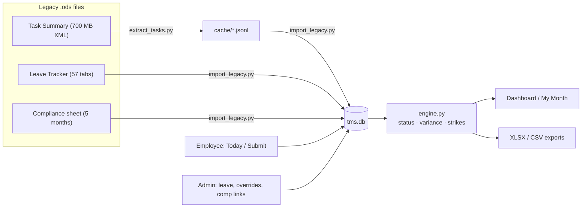

# MK Internal Timekeeping & Compliance App (POC)

**Status:** ✅ Feature-complete against [PRD Draft v1](docs/PRD.md) · ✅ Acceptance test passing (**168/168** historical strike counts reproduced) · ✅ 35 unit tests green · Built 27 Jul 2026

One web app that replaces the three manual spreadsheets used to run offshore time tracking — the per-person **Task Summary** files, the 57-tab **Leave Tracker**, and the monthly **Compliance sheet**. The employee logs time once; leave, hours variance, and compliance status all derive from that single entry automatically. Interim tool until the third-party HR pilot concludes: **designed for export, not permanence.**

New to this codebase? Start with **[HANDOFF.md](HANDOFF.md)**. The original requirements are in **[docs/PRD.md](docs/PRD.md)**.

---

## Contents

1. [Quick start](#quick-start)
2. [Verify the build](#verify-the-build)
3. [Screens & roles](#screens--roles)
4. [How statuses, variance, and strikes are computed](#how-statuses-variance-and-strikes-are-computed)
5. [Data flow](#data-flow)
6. [Configuration reference](#configuration-reference)
7. [The legacy import (read before touching history)](#the-legacy-import)
8. [Project structure](#project-structure)
9. [Testing](#testing)
10. [Path to production](#path-to-production)
11. [Troubleshooting](#troubleshooting)
12. [PRD traceability](#prd-traceability)

---

## Quick start

> ⚠️ The project directory name ends with a **trailing space** (`.../Time Management System /`). Always quote paths.

```bash
cd "/Users/skennedy/Time Management System "
python3 -m venv .venv
.venv/bin/pip install -r requirements.txt

# one-time: stream-extract the 20 MB Task Summary file (~2 min, flat memory)
.venv/bin/python legacy/extract_tasks.py "Task Summary  - Divya (2).ods" legacy/cache/divya

# seed the database from all three legacy files
.venv/bin/python -m legacy.import_legacy

# run
.venv/bin/python -m uvicorn app.main:app --port 8127
```

Open **http://localhost:8127**. Dev sign-in: pick a user, no password.
**Admins:** Steve, Mary, Norine. Everyone else signs in as an employee.

A pre-seeded `tms.db` ships with the handoff bundle — with it you can skip the two import steps and run immediately.

## Verify the build

```bash
.venv/bin/python -m pytest tests/ -q       # engine + validation rules  → 35 passed
.venv/bin/python -m legacy.verify_strikes  # PRD §12.3 acceptance       → 168/168 person-months match
```

`verify_strikes` recomputes every person's March–July 2026 monthly strike count from imported data and compares it to the legacy sheet's own `STRIKES FOR MONTH` values. **If you change the engine or importer, this must stay 168/168.**

## Screens & roles

| Screen | URL | Who | What it does |
|---|---|---|---|
| Today | `/today` | Employee | Log task rows (dropdown project/task, details, start/end). Duration and daily total are computed, never typed. Overlaps blocked; >15 min gaps flagged (not blocked); 4 h row cap; back-dating limited to N working days. **Submit Day** locks the day. |
| My Month | `/my-month` | Employee | Own status calendar, hours vs target per day, running variance balance, leave by category, live strike count (deliberate: today people find out after the fact). |
| Compliance dashboard | `/admin` | Admin | The monthly sheet rebuilt live: rows = employees grouped by department, columns = days, cells = auto-derived status, strikes per row, violation flag at threshold. Filters: month, department, exceptions-only. Nothing here is typed. |
| Person detail | `/admin/person/{id}` | Admin | Full log, ledger with running balance, leave history, day-status overrides (mandatory reason, audited, ⚑-flagged), submission unlocks (audited), compensation links. |
| Roster | `/admin/roster` | Admin | Add/edit/deactivate people; department, designation, per-person daily target, per-person work-day schedule, start date, admin/tracked flags. Deactivation keeps history, drops the person from compliance runs. |
| Lists | `/admin/lists` | Admin | Manage Project/Employer and Task dropdowns. Deactivating hides a value from new entries without breaking old rows. |
| Leave | `/admin/leave` | Admin | Record leave (single day or range; full-day or partial hours; Casual/Sick/Vacation/Other-with-note). Recomputes affected days immediately. |
| Config | `/admin/config` | Admin | Every PRD §10 open question as a dial, plus the company holiday table. |
| Audit | `/admin/audit` | Admin | Last 300 audited actions (unlocks, overrides, config changes, imports, comp links…). |
| Exports | `/export/…` | Admin | `dashboard.xlsx` (legacy sheet layout — the pilot-handoff bridge), `person/{id}.xlsx` (Ledger/Entries/Leave), `entries.csv?start=&end=`. |

## How statuses, variance, and strikes are computed

All in [app/engine.py](app/engine.py). Computed on page load and on every relevant change (submission, leave, override, comp link) — no typing, no nightly batch needed at this scale (a Recompute button exists anyway).

| Status | Condition |
|---|---|
| **Complete** | Day submitted and `actual ≥ target − tolerance` |
| **Partial** | Day submitted and `actual < target − tolerance` |
| **Missing** | *Past* working day, no submission, no covering leave. Today is never Missing — it isn't over. |
| **Leave** | Approved leave covers the (possibly reduced) full target |
| **Holiday / Weekend** | Non-working day per person schedule or holiday table. Hours logged anyway count as pure surplus (weekend make-up work is real and feeds compensation). |

- `variance = actual − effective_target`, where approved leave reduces the target (full-day leave ⇒ target 0, variance 0). The ledger shows per-day variance and the **running net balance** the old tracker implied but never computed.
- `strikes(month) = count(Missing) + count(Partial)` — the sheet's own verified rule.
- **Precedence:** admin override (mandatory reason, audited) → compensation (a fully-covered shortfall reads Complete; original status retained) → base computed/imported status. Legacy pre-policy days carry `strike_exempt` and can never strike.
- **Violation** = strikes ≥ threshold ⇒ dashboard flag only. Pay action stays human (PRD §6).
- Compensation links: one shortfall day → one or more surplus days; a surplus day can back only one shortfall; "fully compensated" means linked surplus ≥ deficit.

## Data flow



Two kinds of `DayStatus` rows coexist:

- `source='imported'` — **frozen legacy fact**, raw sheet token retained, never recomputed.
- `source='computed'` — rebuilt from live entries/leave at any time, from `live_start_date` onward.

## Configuration reference

Admin → Config. Stored in the `config` table; defaults in [app/models.py](app/models.py) (`CONFIG_DEFAULTS`).

| Key | Default | Meaning | PRD |
|---|---|---|---|
| `tolerance_minutes` | 60 | Below `target − tolerance` ⇒ Partial | §10.2 |
| `strike_threshold` | 5 | Monthly strikes ⇒ In-Violation flag | §10.1 |
| `max_row_minutes` | 240 | Max single entry length | §4 |
| `backdate_working_days` | 1 | How far back employees may log | §10.7 |
| `gap_flag_minutes` | 15 | Gap size that gets a visual flag | §4 |
| `min_details_chars` | 5 | Details minimum length | §4 |
| `comp_erases_strike` | on | Fully compensated shortfall reads Complete | §10.3 |
| `live_start_date` | import day | Frozen history before, live computation after | §9 |

Per-person schedule (work days, daily target) lives on the roster (§10.8). Holidays are an admin-maintained table, single region (§10.9). Leave quotas: not enforced, totals displayed (§10.6).

## The legacy import

`legacy/` contains a stdlib-only **streaming ODS reader** (`ods_reader.py`) built to survive the degraded files (flat memory over the 700 MB XML; caps the 16,331 repeated empty columns per row), the task **extractor** (`extract_tasks.py`, reusable for any Task Summary file), the **importer** (`import_legacy.py`), and the **acceptance verifier** (`verify_strikes.py`).

Truths the importer encodes — discovered from the files, not assumed:

1. **Only literal `N`/`PARTIAL` are strikes** (the sheet's COUNTIF). Free-text hours ("4 hours 30 min", "LOGIN-… Hours-8.10 hrs …"), `TRAVEL`, `Absent`, `LE`, `working` never counted — they import as non-strike statuses with the raw token kept.
2. **April 2026 formulas count only from Apr 15** (compliance policy start — the ranges literally start at column R). Pre-policy N/PARTIAL days keep their true status but are `strike_exempt` (faded on the dashboard). Without this, 13 person-months don't reproduce.
3. **Weekend free-text hours are surplus**, imported as Weekend status with positive variance — that's the make-up time compensation links point at.
4. **Names drift across months.** Variant merging is deliberately conservative (space-stripped equality / ≥6-char prefix / shared ≥6-char surname, and only when the two records never overlap in time): `Haswatha`≡`Haswathi`, `Maha Lakshmi`≡`Mahalakshmi`, `Sreenivasan`≡`Srinivasan Jayamoorthy`, tracker tab `Surendhar` → `Surendar Lakshmanan` — while `Krithika` ≠ `Karthika` stay distinct. Junk rows (`Mail Room / Print`) dropped.
5. **Leave tracker** rows become leave/incident records (notes preserved); the monthly `extra`/`short` blocks become per-day variance so running balances carry history; `Standard work hours: Total X` rows set per-person targets; post-`GONE` tabs import as deactivated people with history.
6. **The hidden `List` sheet** seeds the real dropdowns: 297 Project/Employer values, 35 task types.
7. **Task history is best-effort** (PRD §11): 677 real rows recovered from ~1.05 M junk rows; the 12-hour-clock wrap bug (12:00→1:00 logged as a 13-hour task) is normalized monotonically; 492 rows had full times and became entries + locked submissions; 185 without times are listed in the report.
8. Company holidays are auto-detected when ≥5 people share a `Holiday` token on the same date.

Every anomaly the importer tolerates is written to **`legacy/cache/import_report.json`** — duplicates merged, tokens skipped, unmatched tabs, unanchored variance, skipped task rows. Read it after any re-import.

**Re-import from scratch** (the importer refuses to run into a non-empty DB):

```bash
rm tms.db && .venv/bin/python -m legacy.import_legacy && .venv/bin/python -m legacy.verify_strikes
```

## Project structure

```
app/
  main.py            FastAPI app, session middleware, exception→login redirects
  db.py              engine/session; SQLite default, DATABASE_URL for Postgres
  models.py          all entities (PRD §8) + CONFIG_DEFAULTS  — minutes everywhere
  engine.py          status/variance/strike computation, recompute, ledger
  validation.py      PRD §4 entry rules + back-dating window + gap flags
  auth.py            dev pick-a-user auth; the Entra ID swap point
  templating.py      Jinja env, filters (hm, hm_signed, clock), flash helpers
  routes/            auth, employee (Today/My Month), admin (7 screens), exports
  templates/         base + 11 pages (server-rendered, one small JS snippet)
  static/app.css     the whole look
legacy/
  ods_reader.py      streaming ODS parser (stdlib only)
  extract_tasks.py   Task Summary → JSONL cache (reusable per person)
  import_legacy.py   the seed importer (PRD §9)
  verify_strikes.py  acceptance test (PRD §12.3)
  cache/             extraction cache + import_report.json
tests/               35 tests: engine rules, validation rules
docs/PRD.md          the requirements this was built against
HANDOFF.md           read this first if you're picking the project up
```

~2,900 lines of app code. No JS framework, no build step; the only runtime deps are FastAPI, SQLAlchemy, Jinja2, openpyxl.

## Testing

```bash
.venv/bin/python -m pytest tests/ -q
```

- `test_engine.py` — status mapping incl. exact tolerance boundaries, leave-reduced targets, weekend surplus, part-time targets, strike counting, compensation on/off, override precedence, pre-policy exemption.
- `test_validation.py` — overlaps, touching rows, midnight/duration/details rules, locked days, deactivated dropdown values, back-dating across weekends and holidays, gap flags.

Schema changes: there's deliberately no migration tool in the POC — `rm tms.db`, re-run the importer (~40 s total).

## Path to production

The PRD's §9 targets, in recommended order:

1. **Postgres** — set `DATABASE_URL=postgresql+psycopg://…` (add `psycopg[binary]` to requirements). No code changes; SQLAlchemy handles the dialect. Do this before multi-user rollout (~45 people submitting at end of day).
2. **Entra ID** — replace the two dev routes in [app/routes/auth.py](app/routes/auth.py) with an MSAL authorization-code flow; map the tenant email → `Employee.email`; set `AUTH_MODE=entra` and a real `SECRET_KEY`. Role stays `Employee.is_admin`; nothing else changes. Populate `Employee.email` in the roster first.
3. **Azure App Service** — same tenant as the mail system. `uvicorn app.main:app` behind the App Service HTTPS front end; DB = Azure Database for PostgreSQL; run the importer once against the final copies of the three files, then freeze the spreadsheets read-only.
4. **Cutover checklist** — verify 168/168 on the production import; fix the two roster items flagged in the import report (part-timer targets); announce; spreadsheets become read-only archives.

## Troubleshooting

| Symptom | Cause / fix |
|---|---|
| `No such file or directory` on cd | The directory name ends with a space — quote it: `cd "/Users/skennedy/Time Management System "` |
| Importer prints "Database is not empty — refusing" | By design. `rm tms.db` first (or keep the DB — it means you already imported). |
| Port 8127 in use | Another instance is running: `lsof -ti:8127 | xargs kill` |
| Dashboard shows `·` on a past weekday | Legacy blank (no sheet mark) — historical blanks are *not* fabricated into Missing. Live days after `live_start_date` do compute Missing. |
| A person's April strikes look "too low" | Pre-policy days (before Apr 15 2026) are strike-exempt, matching the sheet's own formulas. Hover the faded cells. |
| Times look shifted 12 h in old task rows | The legacy files logged 12-hour clock times without AM/PM; the importer normalizes monotonically per day. Raw values are in `legacy/cache/divya.jsonl`. |

## PRD traceability

| PRD | Where implemented |
|---|---|
| §4 entry rules + submission/locking | `app/validation.py`, `app/routes/employee.py`, Today screen |
| §5 leave, variance, running balance, compensation | `app/engine.py`, `app/routes/admin.py` (leave, comp links), My Month + Person screens |
| §6 statuses, strikes, overrides, violations | `app/engine.py`, DayStatus model, dashboard + person screens |
| §7 all nine screens | `app/routes/` + `app/templates/` (see [Screens & roles](#screens--roles)) |
| §8 data model | `app/models.py` (minutes-based; `unlock_log` realized as audit entries + `unlock_count`) |
| §9 seed import + acceptance | `legacy/import_legacy.py`, `legacy/verify_strikes.py` → **168/168** |
| §10 open questions | all nine are config dials / roster fields (see [Configuration reference](#configuration-reference)) |
| §11 out of scope | honored; see HANDOFF for the fast-follow list |
| §12 success criteria | 1: zero-arithmetic flow verified · 2: dashboard live · 3: 168/168 · 4: three export endpoints |
